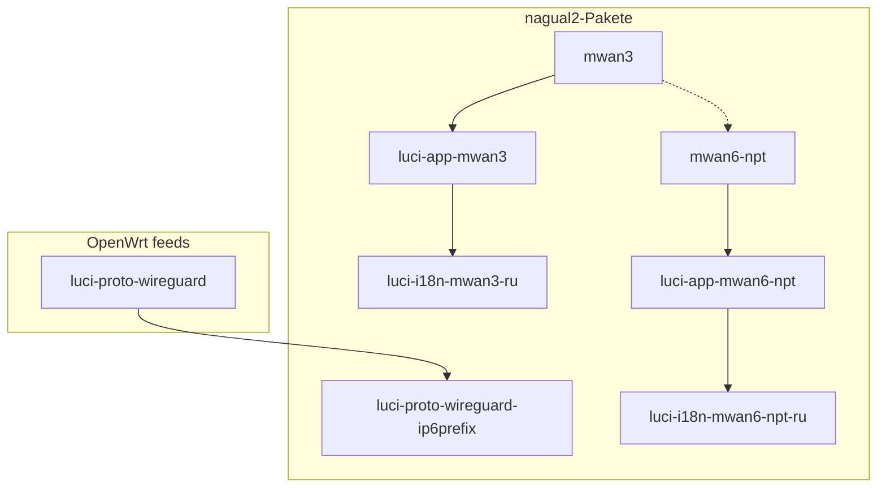

# nagual2-Stack-Installation: IPv6 Multi-WAN + NPTv6

[English](INSTALL-stack.en.md) | [Русский](INSTALL-stack.ru.md) | **Deutsch**

Einheitliche Anleitung zur Installation und Konfigurationsreihenfolge für **mehrere IPv6-WANs** (WireGuard, 6in4, …) mit **mwan3**-Lastverteilung, **NPTv6**-Präfixübersetzung (**mwan6-npt**) und der **LuCI**-Weboberfläche.

**Inhalt:** [§1.1 Minimalvariante](#11-minimalvariante-wenig-ram--ohne-zusätzliches-luci) · [§3 Präfixe](#3-präfixe-was-mwan6-npt-tut-und-was-nicht) · [§3.6 Erstinstallation](#36-erstinstallation-was-das-paket-automatisch-tut) · [§3.7 PD später](#37-paket-installiert-bevor-pd-auf-lan-erschien) · [§3.8 LAN und Tunnel](#38-lan-pd-und-tunnel-einrichten-luci-und-konsole) · [§6 Installation](#6-installation-von-github-releases) · [§8 Konfiguration](#8-konfigurationsreihenfolge-nach-der-installation)

Auf dem Router ist diese Datei nach Installation von **mwan6-npt** verfügbar unter:

`/usr/share/doc/mwan6-npt/INSTALL-stack.de.md`

---

## 1. Stack-Zusammensetzung

| Nr. | Paket | Repository | Rolle |
|-----|-------|------------|-------|
| 1 | **mwan3** | [nagual2/mwan3](https://github.com/nagual2/mwan3) | Policy Routing IPv4/IPv6, Health Check, Failover |
| 2 | **luci-app-mwan3** | [nagual2/luci-app-mwan3](https://github.com/nagual2/luci-app-mwan3) | LuCI für mwan3 und Fork-Optionen |
| 3 | **luci-i18n-mwan3-ru** *(opt.)* | [nagual2/luci-i18n-mwan3-ru](https://github.com/nagual2/luci-i18n-mwan3-ru) | Russische UI für LuCI mwan3 |
| 4 | **luci-proto-wireguard-ip6prefix** *(empfohlen)* | [nagual2/luci-proto-wireguard-ip6prefix](https://github.com/nagual2/luci-proto-wireguard-ip6prefix) | Feld **IPv6 routed prefix** (`ip6prefix`) in LuCI für WireGuard |
| 5 | **mwan6-npt** | [nagual2/mwan6-npt](https://github.com/nagual2/mwan6-npt) | NPTv6 zwischen LAN-Präfix und Tunnel-WAN-Präfixen |
| 6 | **luci-app-mwan6-npt** | [nagual2/mwan6-npt-luci](https://github.com/nagual2/mwan6-npt-luci) | LuCI für mwan6-npt |
| 7 | **luci-i18n-mwan6-npt-ru** *(opt.)* | [nagual2/luci-i18n-mwan6-npt-ru](https://github.com/nagual2/luci-i18n-mwan6-npt-ru) | Russische UI für NPTv6 |

**Abhängigkeiten aus offiziellen Feeds** (meist bereits im LuCI-Image):

- `kmod-wireguard`, `wireguard-tools`, `luci-proto-wireguard` — bei WireGuard-Nutzung;
- `nftables`, `ip-full` — für mwan6-npt (wird mit dem Paket mitgezogen);
- `luci-base`, `rpcd` — für LuCI-Anwendungen.



### 1.1. Minimalvariante (wenig RAM / ohne zusätzliches LuCI)

Bei schwachem Router oder ohne vollständige Weboberfläche nur **Kernpakete** installieren:

| Pflicht | Optional (kann entfallen) |
|---------|---------------------------|
| **mwan3** (nagual2) | luci-i18n-mwan3-ru, luci-i18n-mwan6-npt-ru |
| **mwan6-npt** | luci-app-mwan6-npt (Konfiguration über `uci` / `vi`) |
| **luci-proto-wireguard-ip6prefix** — nur wenn WG in LuCI konfiguriert wird und UCI nicht manuell bearbeitet werden soll | luci-app-mwan3 (`uci` + `mwan3 sync-track-routes` reicht) |

```bash
cd /tmp
apk add --allow-untrusted ./mwan3-*.apk ./mwan6-npt-*.apk
# optional, kleine LuCI-Erweiterung für ip6prefix auf WG:
apk add --allow-untrusted ./luci-proto-wireguard-ip6prefix-*.apk
```

Danach nur **§3** (Präfixe) und **§8.3** (mwan6-npt manuell). Der volle Stack aus §1 dient der Admin-Komfort, nicht dem NPT-Betrieb an sich.

---

## 2. Warum Fork / separates Paket (pro Komponente)

### 2.1. mwan3 — Fork von [openwrt/packages `net/mwan3`](https://github.com/openwrt/packages/tree/master/net/mwan3)

**Warum separates Repository:** Patches für IPv6 Multi-WAN (mehrere WG/Tunnel) ohne den gesamten `packages`-Feed zu pflegen.

**Was hinzugefügt wurde (nagual2):**

| Funktion | UCI / Befehl | Zweck |
|----------|--------------|-------|
| **track_host_routes** | `mwan3.globals.track_host_routes=1` | Routen `/32`/`/128` zu jedem `track_ip` in der mwan3-Tabelle — sonst pingt `mwan3track` nicht über den richtigen IPv6-Tunnel |
| Hotplug + Sync | `mwan3 sync-track-routes` | Host-Routen nach `network restart` wiederherstellen |
| **connected_ipv6** | `connected_ipv6_min_prefixlen=32` | Keine breiten Präfixe (`::/1`, `8000::/1`, `2000::/3`) ins ipset — sonst wird mwan3-Policy umgangen |
| Flush conntrack | `mwan3 flush-conntrack` | Nach Policy-Wechsel — korrektes CONNMARK |

Ohne diesen Fork liefert stock **mwan3** aus Feeds bei „mehrere IPv6-WG + verschiedene Defaults“ oft falsches Interface-Down oder Regelumgehung.

---

### 2.2. luci-app-mwan3 — Fork von [openwrt/luci `applications/luci-app-mwan3`](https://github.com/openwrt/luci)

**Warum Fork:** Stock-LuCI kennt die neuen nagual2-**mwan3**-Optionen nicht.

**Was in der GUI hinzugefügt wurde:**

| Bereich | Optionen / Aktionen |
|---------|---------------------|
| **Netzwerk → MWAN → Globals** | `track_host_routes`, `connected_ipv6_min_prefixlen` |
| **Interfaces** | Pro-Interface-Override `track_host_routes` |
| **Status → Diagnostics** | **Sync track host routes**, **Flush conntrack** |

Erfordert **mwan3** von [nagual2/mwan3](https://github.com/nagual2/mwan3) auf dem Router, nicht stock.

---

### 2.3. luci-i18n-mwan3-ru — Ergänzung zu Feeds `luci-i18n-mwan3-ru`

**Warum separates Paket:** offizielles `luci-i18n-mwan3-ru` übersetzt nur Upstream-Strings; Fork-Strings (`Track host routes (nagual2)`, Diagnose usw.) bleiben auf Englisch.

**Was hinzugefügt wurde:** zusammengeführtes `.lmo` (Upstream `mwan3.po` + `mwan3-nagual2.po`).

**Nach** `luci-app-mwan3` installieren. `luci-app-mwan3` nicht per `apk del` entfernen — Abhängigkeit zieht stock aus Feeds.

---

### 2.4. luci-proto-wireguard-ip6prefix — Patch-Paket für stock `luci-proto-wireguard`

**Warum separates Paket:** in stock LuCI ist das Feld **IPv6 routed prefix** (`ip6prefix`) für WireGuard in **General Settings** versteckt oder fehlt; für NPTv6 und RA auf LAN muss das Präfix auf dem WG-Interface explizit in UCI gesetzt werden (`network.<iface>.ip6prefix`).

**Was hinzugefügt wurde:**

- Feld **IPv6 routed prefix** (`ip6prefix`) auf dem Tab **General Settings** im WireGuard-Editor;
- Doppelte/nicht standardmäßige `pd_prefix`-Bindung entfernt → standard `ip6prefix`;
- Post-Install kopiert gepatchtes `wireguard.js` nach `/www/luci-static/resources/protocol/`.

Abhängig von der **`luci-proto-wireguard`**-Version auf dem Router (in `.apk` `depends`, z. B. `luci-proto-wireguard~26.x`).

---

### 2.5. mwan6-npt — eigenes Paket (kein Fork)

**Warum separates Repository:** in OpenWrt gibt es kein fertiges „NPTv6 für mehrere WANs“ unter **fw4/nftables**.

**Was es tut:**

- Liest `/etc/config/mwan6-npt` (UCI);
- Erzeugt **NPTv6**-Regeln (srcnat/dstnat prefix) in `nftables` über `fw4`-Hooks;
- Hotplug bei Interface up/down;
- Eine `lan`-Sektion mit `default=1` — LAN-Präfixquelle; andere WANs — Übersetzung zu/von ihr.

Ersetzt **mwan3** nicht: mwan3 wählt **welches** WAN; mwan6-npt gleicht **Präfixe** bei unterschiedlichen WAN-Präfixen ab.

---

### 2.6. luci-app-mwan6-npt (Repository mwan6-npt-luci) — eigene LuCI-Anwendung

**Warum separates Repository:** stock LuCI enthält keine UI für mwan6-npt.

**Was hinzugefügt wurde:**

- **Netzwerk → NPTv6 Multi-WAN** — Globals, LAN-Präfix, WAN-Tabelle;
- Auto-Erkennung LAN (`detect-lan-prefix.sh`), WAN-Hinweis (`detect-wan-prefix.sh`);
- **Status → NPTv6 Multi-WAN** — `status`, update, flush;
- **Speichern & Anwenden** → `/etc/init.d/mwan6-npt reload`.

Erfordert installiertes **mwan6-npt**.

---

### 2.7. luci-i18n-mwan6-npt-ru — Lokalisierung

**Warum separates Paket:** wie bei mwan3 — Übersetzung der mwan6-npt-luci-Anwendungsstrings.

**Was hinzugefügt wurde:** `mwan6-npt.ru.lmo` für NPTv6-Menü und Formulare.

**Nach** `luci-app-mwan6-npt` installieren.

---

## 3. Präfixe: was mwan6-npt tut und was nicht

Kurzer Überblick **vor** Installation und Bearbeitung von `/etc/config/mwan6-npt`.

### 3.1. Zwei verschiedene Konfigurationsorte

| Wo | Was wird gesetzt | Zweck |
|----|------------------|-------|
| **`/etc/config/network`** (Interface **lan**, WG/6in4-Tunnel) | **PD / delegiertes Präfix** für LAN: `ip6assign`, `ip6prefix`, RA/SLAAC für Clients | Adressen **im** Netz; IPv6-Vergabe an Hosts |
| **`/etc/config/mwan6-npt`** | Feld **`wan_prefix`** pro Sektion (LAN-Quelle + jedes WAN) | Nur **NPTv6-Regeln** in nftables; hängt **keine** Präfixe an Interfaces |

**mwan6-npt fügt keine Präfixe an Interfaces an** — es liest UCI und erzeugt **Übersetzung** „LAN-Präfix ↔ Tunnel-Präfix“ beim Durchlauf durch fw4.

### 3.2. LAN-Präfix muss keinem Tunnel entsprechen — das ist normal

- Das Präfix, das Sie per **SLAAC auf LAN** (PD) verteilen, **kann von** WAN/WG-Präfixen **abweichen** — so ist NPTv6 gedacht.
- In Tunnel gehen Pakete mit **übersetztem** „rechten Teil“ (Quellpräfix nach NPT), LAN-Clients nutzen weiter **ihr** GUA/PD.
- Sektion **`lan`** in `mwan6-npt` mit `default=1` ist die NPT-**Quelle** (`wan_prefix` dort = Ihr LAN/PD-Präfix in der Paketlogik), nicht „Präfix vom lan-Interface automatisch vom Router“.

**Empfehlung:** in Produktion **GUA** (globale Provider-Präfixe) verwenden, **kein ULA** (`fd00::/8`). ULA in README und Beispielen nur **für Labor** ohne echtes IPv6.

### 3.3. Woher PD auf LAN kommt (Beispiel)

Am Interface **lan** brauchen Sie ein Präfix für **SLAAC/RA**, möglichst stabiles GUA:

- vom Haupt-ISP (PD auf WAN);
- oder **statisches delegiertes Präfix** vom Tunnel-Broker, z. B. [Hurricane Electric Tunnelbroker](https://tunnelbroker.net) — auch wenn **derzeit** dieser Tunnel nicht als Haupt-WAN genutzt wird: das Präfix kann **nur im internen Netz** leben (6in4 auf `henet`, `ip6prefix` / RA auf `lan`), ausgehender Traffic in andere WG-Tunnel geht mit NPT in deren Präfixe;
- dieses LAN-Präfix **muss** keinem Tunnel-`wan_prefix` in `mwan6-npt` entsprechen.

Beispielidee (Zahlen durch eigene ersetzen):

```uci
# /etc/config/network — Ausschnitt
config interface 'lan'
	option ip6assign '64'
	# oder explizit, wenn Broker delegiert hat:
	# list ip6prefix '2001:db8:100::/56'

config interface 'henet'
	option proto '6in4'
	# … Tunnelbroker-Zugangsdaten …
	list ip6prefix '2001:db8:100::/56'
```

### 3.4. WAN / WireGuard: Präfix am Interface

Für jeden Tunnel in **`network`** muss das **routierbare IPv6-Präfix** des Tunnels bekannt sein (was der Kernel auf dem Interface sieht) — meist `list ip6prefix '…'` bei WG.

- Konsole: `uci set network.wg0.ip6prefix='2001:db8:1::/56'` (eigener Interface-Name).
- Wenn UCI nicht manuell bearbeitet werden soll — Paket **[luci-proto-wireguard-ip6prefix](https://github.com/nagual2/luci-proto-wireguard-ip6prefix)**: in LuCI beim WireGuard-Interface in **General Settings** erscheint **IPv6 routed prefix** (`ip6prefix`).

Diese Präfixe werden **nicht automatisch** nach `mwan6-npt` kopiert.

### 3.5. Nach mwan6-npt-Installation ist die Konfiguration für WAN „leer“ — erwartet

Bei Erstinstallation legt das Paket nur an:

- `globals` (`enabled=0`);
- Sektion **`lan`** (`default=1`, ohne fertige Tunnel-`wan_prefix`).

**Warum keine PD/WAN-Präfixe in `/etc/config/mwan6-npt`:** sie müssen **zuerst** in `network` / Ihrem Design gesetzt (oder bewusst gewählt) werden; mwan6-npt **spiegelt** sie nur in `wan_prefix` für nftables. Manuell hinzufügen (LuCI **NPTv6 Multi-WAN** oder UCI):

```bash
uci set mwan6-npt.lan.wan_prefix='2001:db8:100::/56'   # Ihr LAN/PD (NPT-Quelle)
uci add mwan6-npt interface
uci rename mwan6-npt.@interface[-1]='wg0'
uci set mwan6-npt.wg0.wan_prefix='2001:db8:1::/56'
uci set mwan6-npt.wg0.enabled='1'
uci set mwan6-npt.wg0.default='0'
uci commit mwan6-npt
```

Präfix-Hinweise: `/usr/share/mwan6-npt/detect-lan-prefix.sh`, `detect-wan-prefix.sh` (wenn Präfix bereits am Interface).

### 3.6. Erstinstallation: was das Paket automatisch tut

Bei `apk add` / erstem Lauf von **`/etc/uci-defaults/99-mwan6-npt`** (siehe auch Post-Install in `.apk`):

| Schritt | Aktion |
|---------|--------|
| 1 | Legt Vorlage `/etc/config/mwan6-npt` ab (falls Datei noch nicht existierte) |
| 2 | Erstellt `globals.enabled=0`, Sektion **`lan`** (`enabled=1`, `default=1`) |
| 3 | **`detect-lan-prefix.sh`** — sucht PD/GUA für LAN (siehe unten) und schreibt `lan.wan_prefix`, **wenn Feld leer** |
| 4 | **`import-from-mwan3.sh`** — falls `/etc/config/mwan3` existiert, fügt **fehlende** WAN-Sektionen aus aktivierten IPv6-mwan3-Interfaces hinzu (ohne Ihre Änderungen zu überschreiben) |
| 5 | `uci commit`, `enable` init — **ohne** `mwan6-npt update` (nft-Regeln werden nicht erzeugt, solange `globals.enabled=0`) |

**Wie LAN-Präfix ermittelt wird** (`detect-lan-prefix.sh`, nur Lesen):

1. Erstes Nicht-ULA-`ip6prefix` in **`/etc/config/network`** (beliebiges Interface).
2. Sonst — delegiertes Präfix am Interface **`lan`** über `ubus` (`network.interface.lan` → `ipv6-prefix-assignment`).

UCI-Sektion **`mwan6-npt.lan`** ist die NPT-**Quelle** (logischer Name), nicht „irgendeine“ LAN-Bridge; unter OpenWrt hängt PD meist an **`network.lan`**.

### 3.7. Paket installiert, bevor PD auf LAN erschien

Typisch: ISP **delegiert PD nicht automatisch**, Präfix von [Tunnelbroker](https://tunnelbroker.net) oder Statik wird **später** konfiguriert.

Nach `network`-Konfiguration ausführen:

```bash
/usr/share/mwan6-npt/sync-lan-prefix.sh
# oder manuell:
uci set mwan6-npt.lan.wan_prefix='2001:db8:100::/56'
uci commit mwan6-npt
```

Dann NPT aktivieren und Regeln anwenden (§8.3).

### 3.8. LAN (PD) und Tunnel einrichten: LuCI und Konsole

#### A. LAN — Präfixvergabe an Clients (SLAAC/RA)

**LuCI (OpenWrt 23+/25):**

1. **Netzwerk → Schnittstellen → `lan` → Bearbeiten**
2. Tab **Allgemeine Einstellungen** / **IPv6 assignment**:
   - **IPv6 assignment length** (`ip6assign`, oft `64`) — wenn PD vom WAN kommt;
   - oder **IPv6 routed prefix** / Präfixliste — bei statischem GUA (HE, manuelles PD).
3. Für HE 6in4: separates `henet`-Interface (proto `6in4`), Präfix in **`ip6prefix`**, Delegation an `lan` über RA — siehe HE-Dokumentation.
4. **Speichern & Anwenden** → Netzwerk-Neustart.

**Konsole (Beispiele, eigenes GUA einsetzen):**

```bash
# Delegationslänge vom WAN (wenn PD bereits am WAN-Interface)
uci set network.lan.ip6assign='64'

# Oder explizites Präfix auf lan / von HE
uci add_list network.lan.ip6prefix='2001:db8:100::/56'

uci commit network
/etc/init.d/network reload
sleep 3
/usr/share/mwan6-npt/sync-lan-prefix.sh
```

Prüfung: `ubus call network.interface.lan status | jsonfilter -e '@[\"ipv6-prefix-assignment\"]'`

#### B. Tunnel (WAN) — Präfix am Interface

**LuCI:**

1. **Netzwerk → Schnittstellen →** Ihr WG/Tunnel → **Bearbeiten**
2. **General settings** → **IPv6 routed prefix** (`ip6prefix`) — Feld erscheint nach Paket **[luci-proto-wireguard-ip6prefix](https://github.com/nagual2/luci-proto-wireguard-ip6prefix)** (für WireGuard).
3. **Speichern & Anwenden**

**Konsole:**

```bash
uci set network.wg0.ip6prefix='2001:db8:1::/56'   # eigener Interface-Name
uci commit network
/etc/init.d/network reload
```

#### C. Sektionen in `mwan6-npt` (NPT, nicht network)

Nach Präfixen in `network`:

```bash
# LAN-NPT-Quelle (wenn sync-lan-prefix.sh nicht lief)
uci set mwan6-npt.lan.wan_prefix='2001:db8:100::/56'

# WAN-Tunnel (Name = logischer Name in network / mwan3)
uci set mwan6-npt.wg0='interface'
uci set mwan6-npt.wg0.enabled='1'
uci set mwan6-npt.wg0.default='0'
uci set mwan6-npt.wg0.wan_prefix='2001:db8:1::/56'

uci commit mwan6-npt
```

**WAN aus mwan3 importieren** (wenn mwan3 konfiguriert ist, Sektionen in mwan6-npt noch fehlen):

```bash
/usr/share/mwan6-npt/import-from-mwan3.sh
```

Importiert mwan3-Interfaces mit **`enabled=1`** und **`family=ipv6`**; `wan_prefix` aus `network.<name>.ip6prefix` oder `detect-wan-prefix.sh`. Bestehende Sektionen werden **nicht überschrieben**.

**LuCI:** **Netzwerk → NPTv6 Multi-WAN** — LAN-Präfix, WAN aus `network`-Liste hinzufügen, Präfix-Hinweis.

Empfohlene Reihenfolge: **LAN PD in network → sync-lan-prefix → mwan3 → import-from-mwan3 / manuelle WAN → `globals.enabled=1` → reload**.

### 3.9. Weitere Punkte

| Thema | Empfehlung |
|-------|------------|
| Reihenfolge | Zuerst **`network`** (LAN PD + `ip6prefix` auf Tunneln), dann **mwan3**, dann **mwan6-npt** |
| mwan3 ohne LuCI | Bei Minimal-Setup reicht `uci` + `mwan3 sync-track-routes` nach Policy-Wechsel |
| Ein Tunnel = LAN ohne NPT | Wenn Tunnel bereits dasselbe Präfix auf LAN verteilt — WAN-Sektion in mwan6-npt auf **`enabled=0`** |
| RA/odhcpd | Nach LAN-Präfix-Wechsel Netzwerk/`odhcpd` neu starten, RA auf LAN prüfen |
| Speicher | Beide LuCI-Apps + beide i18n auf Routern unter 128 MB RAM nur bei Bedarf installieren |
| Prüfung | `ip -6 addr`, `ip -6 route`, `mwan6-npt status`, `nft list chain inet fw4 srcnat \| grep prefix` |

---

## 4. Anforderungen

| Parameter | Minimum |
|-----------|---------|
| OpenWrt | **22.03+** (fw4 / nftables) |
| Paketmanager | **apk** (25.12+) empfohlen; **opkg** (23.x) unterstützt |
| LuCI | `luci-base` für GUI-Pakete |
| Szenario | Mehrere WANs mit IPv6 (WG, SIT, …), mwan3-Failover + NPTv6 auf LAN nötig |

---

## 5. Installationsreihenfolge (wichtig)

Empfohlene Reihenfolge:

1. WireGuard-Basis aus Feeds (falls WG benötigt).
2. **luci-proto-wireguard-ip6prefix** — vor Interface-Konfiguration in LuCI.
3. **mwan3**
4. **luci-app-mwan3** (+ **luci-i18n-mwan3-ru**)
5. **mwan6-npt**
6. **luci-app-mwan6-npt** (+ **luci-i18n-mwan6-npt-ru**)

Nach Installation — **Pin** in `/etc/apk/world` (siehe §7), dann UCI-Konfiguration (§8, zuerst Präfixe §3).

---

## 6. Installation von GitHub Releases

`.apk` (OpenWrt **25.12+**) oder `.ipk` (**23.x**) von Releases jedes Repositorys herunterladen. Beispiel-Tags zum Dokumentationszeitpunkt:

| Paket | Beispiel-Tag |
|-------|--------------|
| mwan3 | `v2.12.1-r5` |
| luci-app-mwan3 | `v1.0.1` |
| luci-i18n-mwan3-ru | `v1.0.0` |
| mwan6-npt | `v1.1.3` |
| luci-app-mwan6-npt | `v1.2.2` |
| luci-i18n-mwan6-npt-ru | `v1.0.2` |
| luci-proto-wireguard-ip6prefix | `v1.0.0` (r1 oder r2 — siehe unten) |

**Direkte `.apk`-Download-Links (GitHub Releases):**

| Paket | Download |
|-------|----------|
| mwan3 x86_64 (dev/VM) | [mwan3-2.12.1-r5_x86_64.apk](https://github.com/nagual2/mwan3/releases/download/v2.12.1-r5/mwan3-2.12.1-r5_x86_64.apk) |
| mwan3 aarch64 (mediatek prod) | [mwan3-2.12.1-r5_aarch64_cortex-a53.apk](https://github.com/nagual2/mwan3/releases/download/v2.12.1-r5/mwan3-2.12.1-r5_aarch64_cortex-a53.apk) |
| luci-app-mwan3 | [luci-app-mwan3-1.0.1-r1.apk](https://github.com/nagual2/luci-app-mwan3/releases/download/v1.0.1/luci-app-mwan3-1.0.1-r1.apk) |
| luci-i18n-mwan3-ru | [luci-i18n-mwan3-ru-1.0.0-r1.apk](https://github.com/nagual2/luci-i18n-mwan3-ru/releases/download/v1.0.0/luci-i18n-mwan3-ru-1.0.0-r1.apk) |
| mwan6-npt | [mwan6-npt-1.1.3-r1.apk](https://github.com/nagual2/mwan6-npt/releases/download/v1.1.3/mwan6-npt-1.1.3-r1.apk) |
| luci-app-mwan6-npt | [luci-app-mwan6-npt-1.2.2-r1.apk](https://github.com/nagual2/mwan6-npt-luci/releases/download/v1.2.2/luci-app-mwan6-npt-1.2.2-r1.apk) |
| luci-i18n-mwan6-npt-ru | [luci-i18n-mwan6-npt-ru-1.0.2-r1.apk](https://github.com/nagual2/luci-i18n-mwan6-npt-ru/releases/download/v1.0.2/luci-i18n-mwan6-npt-ru-1.0.2-r1.apk) |
| luci-proto-wireguard-ip6prefix r1 (LuCI ~26.143, dev) | […-r1.apk](https://github.com/nagual2/luci-proto-wireguard-ip6prefix/releases/download/v1.0.0/luci-proto-wireguard-ip6prefix-1.0.0-r1.apk) |
| luci-proto-wireguard-ip6prefix r2 (LuCI ~26.138, prod) | […-r2.apk](https://github.com/nagual2/luci-proto-wireguard-ip6prefix/releases/download/v1.0.0/luci-proto-wireguard-ip6prefix-1.0.0-r2.apk) |

**mwan3:** Dateiname hängt von der Architektur ab (`apk info arch` → dritte Zeile). **ip6prefix:** hängt von der installierten `luci-proto-wireguard`-Version ab (`apk policy luci-proto-wireguard`).

### 6.1. OpenWrt 25.12+ (`apk`)

Auf dem Router (oder vom PC via `scp` + `ssh`):

```bash
cd /tmp

# 1) WireGuard LuCI patch (nach luci-proto-wireguard aus feeds)
# apk add luci-proto-wireguard   # falls noch nicht installiert
# r1 — LuCI ~26.143 (dev); r2 — LuCI ~26.138 (prod mediatek)
apk add --allow-untrusted ./luci-proto-wireguard-ip6prefix-1.0.0-r2.apk

# 2) mwan3 (x86_64 oder aarch64_cortex-a53 — siehe Tabelle oben)
apk add --allow-untrusted ./mwan3-2.12.1-r5_aarch64_cortex-a53.apk

# 3) LuCI mwan3
apk add --allow-untrusted ./luci-app-mwan3-*-r*.apk
apk add --allow-untrusted ./luci-i18n-mwan3-ru-*-r*.apk   # optional

# 4) NPTv6
apk add --allow-untrusted ./mwan6-npt-*-r*.apk
apk add --allow-untrusted ./luci-app-mwan6-npt-*-r*.apk
apk add --allow-untrusted ./luci-i18n-mwan6-npt-ru-*-r*.apk   # optional

# LuCI-Dienste
/etc/init.d/rpcd restart
/etc/init.d/uhttpd restart
```

**Vom PC (PowerShell), Beispiel:**

```powershell
$ROUTER = "192.168.1.1"
$DIST = "C:\path\to\downloaded\apks"
scp "$DIST\*.apk" "root@${ROUTER}:/tmp/"
ssh root@$ROUTER "cd /tmp && apk add --allow-untrusted ./mwan3-*.apk ./luci-app-mwan3-*.apk ./mwan6-npt-*.apk ./luci-app-mwan6-npt-*.apk"
```

Fertige Installationsskripte in Repositories:

| Paket | Skript |
|-------|--------|
| mwan3 | `./scripts/install-apk.sh <router-ip>` |
| luci-app-mwan3 | `./scripts/install-apk.sh <router-ip>` |
| mwan6-npt | `./scripts/install-apk.sh <router-ip>` |
| mwan6-npt-luci | `./scripts/install-apk.sh <router-ip>` |
| luci-proto-wireguard-ip6prefix | `./scripts/install-apk.sh <router-ip>` |
| luci-i18n-mwan3-ru | `./scripts/install-apk.sh <router-ip>` |
| luci-i18n-mwan6-npt-ru | `./scripts/install-apk.sh <router-ip>` |

Auf prod nach Flash: `Backup/openwrt-prod/scripts/install_prod_packages.sh` (Feeds + nagual2 von GitHub).

### 6.2. OpenWrt 23.x (`opkg` / `.ipk`)

```bash
cd /tmp
opkg install ./mwan3_*.ipk
opkg install ./luci-app-mwan3_*.ipk
opkg install ./luci-i18n-mwan3-ru_*.ipk      # optional
opkg install ./mwan6-npt_*.ipk
opkg install ./luci-app-mwan6-npt_*.ipk
opkg install ./luci-i18n-mwan6-npt-ru_*.ipk  # optional
opkg install ./luci-proto-wireguard-ip6prefix_*.ipk

/etc/init.d/mwan3 enable
/etc/init.d/mwan3 start
/etc/init.d/rpcd restart
/etc/init.d/uhttpd restart
```

Bei **apk** wird kein Pin für opkg-Pakete genutzt; Feed-Updates können stock überschreiben — unter 23.x Versionen manuell beobachten.

---

## 7. Fork festhalten (Pin, nur `apk`)

Bei `apk add --allow-untrusted ./package.apk` erscheint in `/etc/apk/world` eine Zeile mit Build-Hash:

```text
mwan3><Q1……………=
luci-app-mwan3><Q1……………=
mwan6-npt><Q1……………=
luci-app-mwan6-npt><Q1……………=
```

Ohne `><` kommt das Paket aus **offiziellen Feeds** (stock), was IPv6 Multi-WAN **bricht**.

**Prüfung:**

```bash
grep -E '^(mwan3|mwan6-npt|luci-app-mwan3|luci-app-mwan6-npt|luci-proto-wireguard-ip6prefix)><' /etc/apk/world
apk policy mwan3
apk policy mwan6-npt
```

Mehr: [luci-app-mwan3 — Pinning](https://github.com/nagual2/luci-app-mwan3/blob/main/README.de.md#fork-pinnen-apk).

**Fork aktualisieren:** erneut `apk add --allow-untrusted ./NEW.apk` — Pin wird aktualisiert.

**Nicht** `apk del luci-app-mwan3` bei installiertem `luci-i18n-mwan3-ru` — apk kann stock LuCI installieren.

---

## 8. Konfigurationsreihenfolge nach der Installation

Zuerst **§3** (Präfixe) lesen. Kurzkette: **network (LAN PD + ip6prefix auf Tunneln) → mwan3 → mwan6-npt**.

### 8.1. Netzwerk, LAN PD und WireGuard

1. **lan** — PD/GUA für SLAAC setzen (`ip6assign` / `ip6prefix` / Delegation von HE oder ISP); siehe §3.3.
2. **Tunnel** — für jedes WAN/WG **`ip6prefix`** in `network` setzen (Konsole oder [luci-proto-wireguard-ip6prefix](https://github.com/nagual2/luci-proto-wireguard-ip6prefix)); siehe §3.4.
3. `network reload` / Interface-Neustart; `ip -6 addr show dev lan` und Tunnel prüfen.
4. **Firewall**-Zonen LAN/WAN — nach Ihrem Design.

### 8.2. mwan3

1. LuCI: **Netzwerk → Load Balancing (MWAN)** oder `/etc/config/mwan3`.
2. Interfaces aktivieren, `track_ip`, Policies, Members.
3. Unter **Globals** prüfen:
   - `track_host_routes` — **1** (für IPv6 WG);
   - `connected_ipv6_min_prefixlen` — **32**.
4. Anwenden:

```bash
/etc/init.d/mwan3 restart
mwan3 sync-track-routes
```

### 8.3. mwan6-npt

Nach Installation **keine** fertigen Tunnel-`wan_prefix` in der Konfig — nur `lan`-Sektion; siehe §3.5.

1. LuCI: **Netzwerk → NPTv6 Multi-WAN** oder `vi /etc/config/mwan6-npt`.
2. **`lan.wan_prefix`** — dasselbe Präfix wie auf LAN (PD), muss **keinem** Tunnel entsprechen.
3. Pro WAN Sektion hinzufügen (Name = logischer Name in `network`), **`wan_prefix`** = Tunnel-Präfix aus `network` (wird nicht automatisch gesetzt).
4. Tunnel, der bereits dasselbe Präfix auf LAN ohne NPT trägt — `option enabled '0'`.
5. Aktivieren und anwenden:

```bash
uci set mwan6-npt.globals.enabled='1'
uci commit mwan6-npt
/etc/init.d/mwan6-npt reload
/etc/init.d/mwan6-npt enable
```

**Prüfung:**

```bash
/usr/sbin/mwan6-npt status
nft list chain inet fw4 srcnat | grep -i prefix
```

### 8.4. Russische Oberfläche

**System → Sprache → Русский (Russian)** → Speichern → Browser aktualisieren.

---

## 9. Lokaler apk-Feed (mehrere Router)

Siehe [luci-app-mwan3 — lokaler Feed](https://github.com/nagual2/luci-app-mwan3/blob/main/README.de.md#optional-lokaler-apk-feed): alle `.apk` unter `/www/nagual2/` veröffentlichen. Installation weiterhin mit **`--allow-untrusted`**; nach Installation Pin prüfen (§7).

---

## 10. Fehlerbehebung

| Symptom | Prüfung |
|---------|---------|
| Nach Installation keine Präfixe in mwan6-npt | Normal, wenn PD noch nicht in **network**: §3.7–3.8, `sync-lan-prefix.sh` |
| Import aus mwan3 leer | Kein `enabled=1` + `family=ipv6` in mwan3; WAN manuell setzen oder Interfaces in mwan3 aktivieren |
| LAN-Clients ohne globales IPv6 | PD/RA auf **lan** in `network`, GUA nicht nur ULA (§3.2–3.3) |
| NPT aktiv, LAN-Adressen „falsch“ | `lan.wan_prefix` muss mit LAN-Vergabe-Präfix übereinstimmen, nicht mit Tunnel |
| mwan3track sieht IPv6-Peer nicht | `track_host_routes=1`, `mwan3 sync-track-routes`, `ip -6 route show table …` |
| Traffic umgeht Policy | `connected_ipv6_min_prefixlen`, `mwan3 flush-conntrack` nach Policy-Wechsel |
| Kein IPv6-Präfix-Feld bei WG | **luci-proto-wireguard-ip6prefix** installiert, `uhttpd` neu starten |
| NPT funktioniert nicht | `globals.enabled=1`, `mwan6-npt reload`, `nft`-Regeln, UCI/network Interface-Namen stimmen |
| Nach `apk upgrade` wieder stock | `grep '><' /etc/apk/world`, nagual2 `.apk` neu installieren |
| Englische Strings in LuCI | **luci-i18n-*-ru** nach App-Paket installieren |

---

## 11. Paketdokumentation

| Thema | Pfad auf Router / Link |
|-------|------------------------|
| Dieses Dokument | `/usr/share/doc/mwan6-npt/INSTALL-stack.de.md` |
| mwan6-npt | `/usr/share/doc/mwan6-npt/README.de.md` |
| mwan3 | `/usr/share/doc/mwan3/README.de.md` |
| luci-app-mwan3 | `/usr/share/doc/luci-app-mwan3/README.de.md` |
| luci-app-mwan6-npt | `/usr/share/doc/luci-app-mwan6-npt/README.de.md` |
| luci-proto-wireguard-ip6prefix | [GitHub README.de.md](https://github.com/nagual2/luci-proto-wireguard-ip6prefix/blob/master/README.de.md) |

---

## 12. Lizenzen

| Paket | Lizenz |
|-------|--------|
| mwan3, luci-app-mwan3 | GPL-2.0 (wie Upstream) |
| mwan6-npt, luci-app-mwan6-npt, i18n, wireguard-ip6prefix | Apache-2.0 (wie LuCI) / siehe `NOTICE` in jedem Repository |

---

*Dieses Dokument ist im Paket **mwan6-npt** (nagual2) enthalten. Anleitungsversion: 2026-06-06.*
