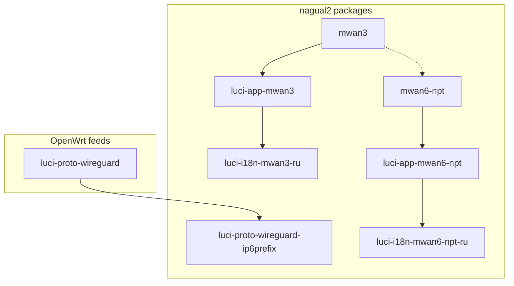

# nagual2 stack installation: IPv6 multi-WAN + NPTv6

[Русский](INSTALL-stack.ru.md) | **English** | [Deutsch](INSTALL-stack.de.md)

Unified installation and configuration guide for **multiple IPv6 WANs** (WireGuard, 6in4, …) with **mwan3** load balancing, **NPTv6** prefix translation (**mwan6-npt**), and the **LuCI** web interface.

**Contents:** [§1.1 minimal setup](#11-minimal-setup-little-ram--without-extra-luci) · [§3 prefixes](#3-prefixes-what-mwan6-npt-does-and-what-it-doesnt) · [§3.6 first install](#36-first-install-what-the-package-does-automatically) · [§3.7 PD later](#37-package-installed-before-pd-appeared-on-lan) · [§3.8 LAN and tunnels](#38-configure-lan-pd-and-tunnels-luci-and-console) · [§6 installation](#6-installation-from-github-releases) · [§8 configuration](#8-configuration-order-after-installation)

After installing **mwan6-npt** on the router, this file is available at:

`/usr/share/doc/mwan6-npt/INSTALL-stack.en.md`

---

## 1. Stack composition

| # | Package | Repository | Role |
|---|---------|------------|------|
| 1 | **mwan3** | [nagual2/mwan3](https://github.com/nagual2/mwan3) | Policy routing IPv4/IPv6, health check, failover |
| 2 | **luci-app-mwan3** | [nagual2/luci-app-mwan3](https://github.com/nagual2/luci-app-mwan3) | LuCI for mwan3 and fork options |
| 3 | **luci-i18n-mwan3-ru** *(opt.)* | [nagual2/luci-i18n-mwan3-ru](https://github.com/nagual2/luci-i18n-mwan3-ru) | Russian UI for LuCI mwan3 |
| 4 | **luci-proto-wireguard-ip6prefix** *(recommended)* | [nagual2/luci-proto-wireguard-ip6prefix](https://github.com/nagual2/luci-proto-wireguard-ip6prefix) | **IPv6 routed prefix** field (`ip6prefix`) in LuCI for WireGuard |
| 5 | **mwan6-npt** | [nagual2/mwan6-npt](https://github.com/nagual2/mwan6-npt) | NPTv6 between LAN prefix and tunnel WAN prefixes |
| 6 | **luci-app-mwan6-npt** | [nagual2/mwan6-npt-luci](https://github.com/nagual2/mwan6-npt-luci) | LuCI for mwan6-npt |
| 7 | **luci-i18n-mwan6-npt-ru** *(opt.)* | [nagual2/luci-i18n-mwan6-npt-ru](https://github.com/nagual2/luci-i18n-mwan6-npt-ru) | Russian UI for NPTv6 |

**Dependencies from official feeds** (usually already on a LuCI image):

- `kmod-wireguard`, `wireguard-tools`, `luci-proto-wireguard` — if you use WireGuard;
- `nftables`, `ip-full` — for mwan6-npt (pulled in with the package);
- `luci-base`, `rpcd` — for LuCI applications.



### 1.1. Minimal setup (little RAM / without extra LuCI)

If the router is low on resources or you do not need the full web interface, install **core packages only**:

| Required | Optional (can skip) |
|----------|---------------------|
| **mwan3** (nagual2) | luci-i18n-mwan3-ru, luci-i18n-mwan6-npt-ru |
| **mwan6-npt** | luci-app-mwan6-npt (configure via `uci` / `vi`) |
| **luci-proto-wireguard-ip6prefix** — only if you configure WG in LuCI and prefer not to edit UCI manually | luci-app-mwan3 (`uci` + `mwan3 sync-track-routes` is enough) |

```bash
cd /tmp
apk add --allow-untrusted ./mwan3-*.apk ./mwan6-npt-*.apk
# optional, one small LuCI add-on for ip6prefix on WG:
apk add --allow-untrusted ./luci-proto-wireguard-ip6prefix-*.apk
```

Then follow **§3** (prefixes) and **§8.3** (mwan6-npt manually). The full stack in §1 is for administration convenience, not required for NPT itself.

---

## 2. Why a fork / separate package (per item)

### 2.1. mwan3 — fork of [openwrt/packages `net/mwan3`](https://github.com/openwrt/packages/tree/master/net/mwan3)

**Why a separate repository:** patches for IPv6 multi-WAN (multiple WG/tunnels) without maintaining the entire `packages` feed.

**What was added (nagual2):**

| Feature | UCI / command | Purpose |
|---------|---------------|---------|
| **track_host_routes** | `mwan3.globals.track_host_routes=1` | `/32`/`/128` routes to each `track_ip` in the mwan3 table — otherwise `mwan3track` cannot ping over the correct IPv6 tunnel |
| Hotplug + sync | `mwan3 sync-track-routes` | Restore host routes after `network restart` |
| **connected_ipv6** | `connected_ipv6_min_prefixlen=32` | Do not add wide prefixes (`::/1`, `8000::/1`, `2000::/3`) to ipset — otherwise mwan3 policy is bypassed |
| Flush conntrack | `mwan3 flush-conntrack` | After policy change — correct CONNMARK |

Without this fork, stock **mwan3** from feeds often reports a false interface down or bypasses rules in “multiple IPv6 WG + different defaults” scenarios.

---

### 2.2. luci-app-mwan3 — fork of [openwrt/luci `applications/luci-app-mwan3`](https://github.com/openwrt/luci)

**Why a fork:** stock LuCI does not know nagual2 **mwan3** options.

**What was added in the GUI:**

| Section | Options / actions |
|---------|-------------------|
| **Network → MWAN → Globals** | `track_host_routes`, `connected_ipv6_min_prefixlen` |
| **Interfaces** | Per-interface override `track_host_routes` |
| **Status → Diagnostics** | **Sync track host routes**, **Flush conntrack** |

Requires **mwan3** from [nagual2/mwan3](https://github.com/nagual2/mwan3) on the router, not stock.

---

### 2.3. luci-i18n-mwan3-ru — supplement to feeds `luci-i18n-mwan3-ru`

**Why a separate package:** official `luci-i18n-mwan3-ru` translates upstream strings only; fork strings (`Track host routes (nagual2)`, diagnostics, etc.) remain in English.

**What was added:** merged `.lmo` (upstream `mwan3.po` + `mwan3-nagual2.po`).

Install **after** `luci-app-mwan3`. Do not remove `luci-app-mwan3` via `apk del` — the dependency will pull stock from feeds.

---

### 2.4. luci-proto-wireguard-ip6prefix — patch package for stock `luci-proto-wireguard`

**Why a separate package:** in stock LuCI the **IPv6 routed prefix** field (`ip6prefix`) for WireGuard is hidden or missing in **General Settings**; for NPTv6 and RA on LAN the prefix on the WG interface must be set explicitly in UCI (`network.<iface>.ip6prefix`).

**What was added:**

- **IPv6 routed prefix** field (`ip6prefix`) on the **General Settings** tab in the WireGuard editor;
- Removed duplicate/non-standard `pd_prefix` binding → standard `ip6prefix`;
- Post-install copies patched `wireguard.js` to `/www/luci-static/resources/protocol/`.

Depends on the **`luci-proto-wireguard`** version on the router (specified in `.apk` `depends`, e.g. `luci-proto-wireguard~26.x`).

---

### 2.5. mwan6-npt — standalone package (not a fork)

**Why a separate repository:** OpenWrt has no ready-made “NPTv6 for multiple WANs” equivalent for **fw4/nftables**.

**What it does:**

- Reads `/etc/config/mwan6-npt` (UCI);
- Generates **NPTv6** rules (srcnat/dstnat prefix) in `nftables` via `fw4` hooks;
- Hotplug on interface up/down;
- One `lan` section with `default=1` — LAN prefix source; other WANs — translation to/from it.

Does **not** replace **mwan3**: mwan3 chooses **which** WAN to use; mwan6-npt aligns **prefixes** when WAN prefixes differ.

---

### 2.6. luci-app-mwan6-npt (mwan6-npt-luci repository) — standalone LuCI application

**Why a separate repository:** stock LuCI has no UI for mwan6-npt.

**What was added:**

- **Network → NPTv6 Multi-WAN** — globals, LAN prefix, WAN table;
- Auto-detect LAN (`detect-lan-prefix.sh`), WAN hint (`detect-wan-prefix.sh`);
- **Status → NPTv6 Multi-WAN** — `status`, update, flush;
- **Save & Apply** → `/etc/init.d/mwan6-npt reload`.

Requires **mwan6-npt** installed.

---

### 2.7. luci-i18n-mwan6-npt-ru — localization

**Why a separate package:** same as mwan3 — translation of mwan6-npt-luci application strings.

**What was added:** `mwan6-npt.ru.lmo` for NPTv6 menu and forms.

Install **after** `luci-app-mwan6-npt`.

---

## 3. Prefixes: what mwan6-npt does and what it doesn't

A brief overview **before** installation and editing `/etc/config/mwan6-npt`.

### 3.1. Two different configuration locations

| Where | What is configured | Purpose |
|-------|-------------------|---------|
| **`/etc/config/network`** (interface **lan**, WG/6in4 tunnels) | **PD / delegated prefix** for LAN: `ip6assign`, `ip6prefix`, RA/SLAAC for clients | Addresses **inside** the network; IPv6 for hosts |
| **`/etc/config/mwan6-npt`** | **`wan_prefix`** field per section (LAN source + each WAN) | **NPTv6 rules only** in nftables; does **not** assign prefixes to interfaces |

**mwan6-npt does not add prefixes to interfaces** — it reads UCI and generates **translation** “LAN prefix ↔ tunnel prefix” when packets pass through fw4.

### 3.2. LAN prefix may not match any tunnel — that is normal

- The prefix you distribute via **SLAAC on LAN** (PD) **may not match** WAN/WG prefixes — that is by design for NPTv6.
- Packets into tunnels leave with a **translated** “right part” (source prefix after NPT), while LAN clients keep using **their** GUA/PD.
- The **`lan`** section in `mwan6-npt` with `default=1` is the NPT **source** (`wan_prefix` there = your LAN/PD prefix in packet logic), not “prefix from lan interface auto-detected on router”.

**Recommendation:** in production use **GUA** (provider global prefixes), **not ULA** (`fd00::/8`). ULA in README and examples is **lab-only** without real IPv6.

### 3.3. Where to get PD on LAN (example)

On interface **lan** you need a prefix for **SLAAC/RA**, preferably stable GUA:

- from the main ISP (PD on WAN);
- or a **static delegated prefix** from a tunnel broker, e.g. [Hurricane Electric Tunnelbroker](https://tunnelbroker.net) — even if **currently** that tunnel is not the main WAN: the prefix can live **only on the internal network** (6in4 on `henet`, `ip6prefix` / RA on `lan`), while outbound traffic to other WG tunnels goes with NPT into their prefixes;
- this LAN prefix **does not have to** match any tunnel `wan_prefix` in `mwan6-npt`.

Example idea (replace numbers with yours):

```uci
# /etc/config/network — fragment
config interface 'lan'
	option ip6assign '64'
	# or explicitly, if the broker delegated:
	# list ip6prefix '2001:db8:100::/56'

config interface 'henet'
	option proto '6in4'
	# … tunnelbroker credentials …
	list ip6prefix '2001:db8:100::/56'
```

### 3.4. WAN / WireGuard: prefix on the interface

For each tunnel in **`network`** you need the tunnel's **routable IPv6 prefix** (what the kernel sees on that interface) — usually `list ip6prefix '…'` on WG.

- Console: `uci set network.wg0.ip6prefix='2001:db8:1::/56'` (use your interface name).
- If you prefer not to edit UCI manually — package **[luci-proto-wireguard-ip6prefix](https://github.com/nagual2/luci-proto-wireguard-ip6prefix)**: LuCI WireGuard interface **General Settings** gets **IPv6 routed prefix** (`ip6prefix`).

These prefixes are **not copied** into `mwan6-npt` automatically.

### 3.5. After mwan6-npt install the config is “empty” for WAN — expected

On first install the package creates only:

- `globals` (`enabled=0`);
- **`lan`** section (`default=1`, without ready tunnel `wan_prefix` values).

**Why no PD/WAN prefixes in `/etc/config/mwan6-npt`:** they must be set **first** (or chosen deliberately) in `network` / your design; mwan6-npt only **mirrors** them in `wan_prefix` for nftables. Add manually (LuCI **NPTv6 Multi-WAN** or UCI):

```bash
uci set mwan6-npt.lan.wan_prefix='2001:db8:100::/56'   # your LAN/PD (NPT source)
uci add mwan6-npt interface
uci rename mwan6-npt.@interface[-1]='wg0'
uci set mwan6-npt.wg0.wan_prefix='2001:db8:1::/56'
uci set mwan6-npt.wg0.enabled='1'
uci set mwan6-npt.wg0.default='0'
uci commit mwan6-npt
```

Prefix hints: `/usr/share/mwan6-npt/detect-lan-prefix.sh`, `detect-wan-prefix.sh` (if prefix is already on the interface).

### 3.6. First install: what the package does automatically

On `apk add` / first run of **`/etc/uci-defaults/99-mwan6-npt`** (see also post-install in `.apk`):

| Step | Action |
|------|--------|
| 1 | Drops template `/etc/config/mwan6-npt` (if file did not exist) |
| 2 | Creates `globals.enabled=0`, **`lan`** section (`enabled=1`, `default=1`) |
| 3 | **`detect-lan-prefix.sh`** — finds PD/GUA for LAN (see below) and writes `lan.wan_prefix`, **if field is empty** |
| 4 | **`import-from-mwan3.sh`** — if `/etc/config/mwan3` exists, adds **missing** WAN sections from enabled IPv6 mwan3 interfaces (without overwriting your edits) |
| 5 | `uci commit`, `enable` init — **without** `mwan6-npt update` (nft rules not created while `globals.enabled=0`) |

**How LAN prefix is detected** (`detect-lan-prefix.sh`, read-only):

1. First non-ULA `ip6prefix` in **`/etc/config/network`** (any interface).
2. Otherwise — delegated prefix on **`lan`** via `ubus` (`network.interface.lan` → `ipv6-prefix-assignment`).

UCI section **`mwan6-npt.lan`** is the NPT **source** (logical name), not “any” LAN bridge; on OpenWrt PD is usually on **`network.lan`**.

### 3.7. Package installed before PD appeared on LAN

Typical case: ISP **does not delegate PD automatically**, prefix from [Tunnelbroker](https://tunnelbroker.net) or static config is added **later**.

After configuring `network` run:

```bash
/usr/share/mwan6-npt/sync-lan-prefix.sh
# or manually:
uci set mwan6-npt.lan.wan_prefix='2001:db8:100::/56'
uci commit mwan6-npt
```

Then enable NPT and apply rules (§8.3).

### 3.8. Configure LAN (PD) and tunnels: LuCI and console

#### A. LAN — prefix distribution to clients (SLAAC/RA)

**LuCI (OpenWrt 23+/25):**

1. **Network → Interfaces → `lan` → Edit**
2. Tab **General Settings** / **IPv6 assignment**:
   - **IPv6 assignment length** (`ip6assign`, often `64`) — if PD comes from WAN;
   - or **IPv6 routed prefix** / prefix list — if you set static GUA (HE, manual PD).
3. For HE 6in4: separate `henet` interface (proto `6in4`), prefix in **`ip6prefix`**, delegation to `lan` via RA — see HE documentation.
4. **Save & Apply** → network restart.

**Console (examples, substitute your GUA):**

```bash
# Delegation length from WAN (if PD is already on WAN interface)
uci set network.lan.ip6assign='64'

# Or explicit prefix on lan / from HE
uci add_list network.lan.ip6prefix='2001:db8:100::/56'

uci commit network
/etc/init.d/network reload
sleep 3
/usr/share/mwan6-npt/sync-lan-prefix.sh
```

Check: `ubus call network.interface.lan status | jsonfilter -e '@[\"ipv6-prefix-assignment\"]'`

#### B. Tunnels (WAN) — prefix on the interface

**LuCI:**

1. **Network → Interfaces →** your WG/tunnel → **Edit**
2. **General settings** → **IPv6 routed prefix** (`ip6prefix`) — field appears after **[luci-proto-wireguard-ip6prefix](https://github.com/nagual2/luci-proto-wireguard-ip6prefix)** (for WireGuard).
3. **Save & Apply**

**Console:**

```bash
uci set network.wg0.ip6prefix='2001:db8:1::/56'   # use your interface name
uci commit network
/etc/init.d/network reload
```

#### C. Sections in `mwan6-npt` (NPT, not network)

After prefixes in `network`:

```bash
# LAN NPT source (if sync-lan-prefix.sh was not run)
uci set mwan6-npt.lan.wan_prefix='2001:db8:100::/56'

# WAN tunnel (name = logical name in network / mwan3)
uci set mwan6-npt.wg0='interface'
uci set mwan6-npt.wg0.enabled='1'
uci set mwan6-npt.wg0.default='0'
uci set mwan6-npt.wg0.wan_prefix='2001:db8:1::/56'

uci commit mwan6-npt
```

**Import WAN from mwan3** (if mwan3 is configured but sections are missing in mwan6-npt):

```bash
/usr/share/mwan6-npt/import-from-mwan3.sh
```

Imports mwan3 interfaces with **`enabled=1`** and **`family=ipv6`**; `wan_prefix` is taken from `network.<name>.ip6prefix` or `detect-wan-prefix.sh`. Existing sections are **not overwritten**.

**LuCI:** **Network → NPTv6 Multi-WAN** — LAN prefix, add WAN from `network` list, prefix hint.

Recommended order: **LAN PD in network → sync-lan-prefix → mwan3 → import-from-mwan3 / manual WAN → `globals.enabled=1` → reload**.

### 3.9. Other points worth noting

| Topic | Recommendation |
|-------|----------------|
| Order | First **`network`** (LAN PD + `ip6prefix` on tunnels), then **mwan3**, then **mwan6-npt** |
| mwan3 without LuCI | On minimal setup `uci` + `mwan3 sync-track-routes` after policy change is enough |
| One tunnel = LAN without NPT | If a tunnel already distributes the same prefix on LAN — set that WAN section in mwan6-npt to **`enabled=0`** |
| RA/odhcpd | After LAN prefix change restart network/`odhcpd`, verify RA on LAN |
| Memory | Do not install both LuCI apps + both i18n on routers with less than 128 MB RAM unless needed |
| Verification | `ip -6 addr`, `ip -6 route`, `mwan6-npt status`, `nft list chain inet fw4 srcnat \| grep prefix` |

---

## 4. Requirements

| Parameter | Minimum |
|-----------|---------|
| OpenWrt | **22.03+** (fw4 / nftables) |
| Package manager | **apk** (25.12+) recommended; **opkg** (23.x) supported |
| LuCI | `luci-base` for GUI packages |
| Scenario | Multiple WANs with IPv6 (WG, SIT, …), mwan3 failover + NPTv6 on LAN needed |

---

## 5. Installation order (important)

Recommended order:

1. WireGuard base from feeds (if WG is needed).
2. **luci-proto-wireguard-ip6prefix** — before configuring interfaces in LuCI.
3. **mwan3**
4. **luci-app-mwan3** (+ **luci-i18n-mwan3-ru**)
5. **mwan6-npt**
6. **luci-app-mwan6-npt** (+ **luci-i18n-mwan6-npt-ru**)

After installation — **pin** in `/etc/apk/world` (see §7), then UCI configuration (§8, prefixes first §3).

---

## 6. Installation from GitHub Releases

Download `.apk` (OpenWrt **25.12+**) or `.ipk` (**23.x**) from Releases of each repository. Example tags at documentation time:

| Package | Example tag |
|---------|-------------|
| mwan3 | `v2.12.1-r5` |
| luci-app-mwan3 | `v1.0.1` |
| luci-i18n-mwan3-ru | `v1.0.0` |
| mwan6-npt | `v1.1.3` |
| luci-app-mwan6-npt | `v1.2.2` |
| luci-i18n-mwan6-npt-ru | `v1.0.2` |
| luci-proto-wireguard-ip6prefix | `v1.0.0` (r1 or r2 — see below) |

**Direct `.apk` download links (GitHub Releases):**

| Package | Download |
|---------|----------|
| mwan3 x86_64 (dev/VM) | [mwan3-2.12.1-r5_x86_64.apk](https://github.com/nagual2/mwan3/releases/download/v2.12.1-r5/mwan3-2.12.1-r5_x86_64.apk) |
| mwan3 aarch64 (mediatek prod) | [mwan3-2.12.1-r5_aarch64_cortex-a53.apk](https://github.com/nagual2/mwan3/releases/download/v2.12.1-r5/mwan3-2.12.1-r5_aarch64_cortex-a53.apk) |
| luci-app-mwan3 | [luci-app-mwan3-1.0.1-r1.apk](https://github.com/nagual2/luci-app-mwan3/releases/download/v1.0.1/luci-app-mwan3-1.0.1-r1.apk) |
| luci-i18n-mwan3-ru | [luci-i18n-mwan3-ru-1.0.0-r1.apk](https://github.com/nagual2/luci-i18n-mwan3-ru/releases/download/v1.0.0/luci-i18n-mwan3-ru-1.0.0-r1.apk) |
| mwan6-npt | [mwan6-npt-1.1.3-r1.apk](https://github.com/nagual2/mwan6-npt/releases/download/v1.1.3/mwan6-npt-1.1.3-r1.apk) |
| luci-app-mwan6-npt | [luci-app-mwan6-npt-1.2.2-r1.apk](https://github.com/nagual2/mwan6-npt-luci/releases/download/v1.2.2/luci-app-mwan6-npt-1.2.2-r1.apk) |
| luci-i18n-mwan6-npt-ru | [luci-i18n-mwan6-npt-ru-1.0.2-r1.apk](https://github.com/nagual2/luci-i18n-mwan6-npt-ru/releases/download/v1.0.2/luci-i18n-mwan6-npt-ru-1.0.2-r1.apk) |
| luci-proto-wireguard-ip6prefix r1 (LuCI ~26.143, dev) | […-r1.apk](https://github.com/nagual2/luci-proto-wireguard-ip6prefix/releases/download/v1.0.0/luci-proto-wireguard-ip6prefix-1.0.0-r1.apk) |
| luci-proto-wireguard-ip6prefix r2 (LuCI ~26.138, prod) | […-r2.apk](https://github.com/nagual2/luci-proto-wireguard-ip6prefix/releases/download/v1.0.0/luci-proto-wireguard-ip6prefix-1.0.0-r2.apk) |

**mwan3:** filename depends on architecture (`apk info arch` → third line). **ip6prefix:** depends on installed `luci-proto-wireguard` version (`apk policy luci-proto-wireguard`).

### 6.1. OpenWrt 25.12+ (`apk`)

On the router (or from PC via `scp` + `ssh`):

```bash
cd /tmp

# 1) WireGuard LuCI patch (after luci-proto-wireguard from feeds)
# apk add luci-proto-wireguard   # if not yet installed
# r1 — LuCI ~26.143 (dev); r2 — LuCI ~26.138 (prod mediatek)
apk add --allow-untrusted ./luci-proto-wireguard-ip6prefix-1.0.0-r2.apk

# 2) mwan3 (x86_64 or aarch64_cortex-a53 — see table above)
apk add --allow-untrusted ./mwan3-2.12.1-r5_aarch64_cortex-a53.apk

# 3) LuCI mwan3
apk add --allow-untrusted ./luci-app-mwan3-*-r*.apk
apk add --allow-untrusted ./luci-i18n-mwan3-ru-*-r*.apk   # optional

# 4) NPTv6
apk add --allow-untrusted ./mwan6-npt-*-r*.apk
apk add --allow-untrusted ./luci-app-mwan6-npt-*-r*.apk
apk add --allow-untrusted ./luci-i18n-mwan6-npt-ru-*-r*.apk   # optional

# LuCI services
/etc/init.d/rpcd restart
/etc/init.d/uhttpd restart
```

**From PC (PowerShell), example:**

```powershell
$ROUTER = "192.168.1.1"
$DIST = "C:\path\to\downloaded\apks"
scp "$DIST\*.apk" "root@${ROUTER}:/tmp/"
ssh root@$ROUTER "cd /tmp && apk add --allow-untrusted ./mwan3-*.apk ./luci-app-mwan3-*.apk ./mwan6-npt-*.apk ./luci-app-mwan6-npt-*.apk"
```

Ready-made install scripts in repositories:

| Package | Script |
|---------|--------|
| mwan3 | `./scripts/install-apk.sh <router-ip>` |
| luci-app-mwan3 | `./scripts/install-apk.sh <router-ip>` |
| mwan6-npt | `./scripts/install-apk.sh <router-ip>` |
| mwan6-npt-luci | `./scripts/install-apk.sh <router-ip>` |
| luci-proto-wireguard-ip6prefix | `./scripts/install-apk.sh <router-ip>` |
| luci-i18n-mwan3-ru | `./scripts/install-apk.sh <router-ip>` |
| luci-i18n-mwan6-npt-ru | `./scripts/install-apk.sh <router-ip>` |

On prod after flash: `Backup/openwrt-prod/scripts/install_prod_packages.sh` (feeds + nagual2 from GitHub).

### 6.2. OpenWrt 23.x (`opkg` / `.ipk`)

```bash
cd /tmp
opkg install ./mwan3_*.ipk
opkg install ./luci-app-mwan3_*.ipk
opkg install ./luci-i18n-mwan3-ru_*.ipk      # optional
opkg install ./mwan6-npt_*.ipk
opkg install ./luci-app-mwan6-npt_*.ipk
opkg install ./luci-i18n-mwan6-npt-ru_*.ipk  # optional
opkg install ./luci-proto-wireguard-ip6prefix_*.ipk

/etc/init.d/mwan3 enable
/etc/init.d/mwan3 start
/etc/init.d/rpcd restart
/etc/init.d/uhttpd restart
```

On **apk**, pin is not used for opkg packages; feed upgrades may overwrite stock — on 23.x watch versions manually.

---

## 7. Pinning the fork (pin, `apk` only)

When you `apk add --allow-untrusted ./package.apk`, `/etc/apk/world` gets a line with the build hash:

```text
mwan3><Q1……………=
luci-app-mwan3><Q1……………=
mwan6-npt><Q1……………=
luci-app-mwan6-npt><Q1……………=
```

Without `><` the package comes from **official feeds** (stock), which **breaks** IPv6 multi-WAN.

**Check:**

```bash
grep -E '^(mwan3|mwan6-npt|luci-app-mwan3|luci-app-mwan6-npt|luci-proto-wireguard-ip6prefix)><' /etc/apk/world
apk policy mwan3
apk policy mwan6-npt
```

More: [luci-app-mwan3 — Pinning](https://github.com/nagual2/luci-app-mwan3#pinning-the-nagual2-fork-apk).

**Upgrading the fork:** again `apk add --allow-untrusted ./NEW.apk` — pin updates.

**Do not** `apk del luci-app-mwan3` with `luci-i18n-mwan3-ru` installed — apk may install stock LuCI.

---

## 8. Configuration order after installation

Read **§3** (prefixes) first. Short chain: **network (LAN PD + ip6prefix on tunnels) → mwan3 → mwan6-npt**.

### 8.1. Network, LAN PD and WireGuard

1. **lan** — set PD/GUA for SLAAC (`ip6assign` / `ip6prefix` / delegation from HE or ISP); see §3.3.
2. **Tunnels** — for each WAN/WG set **`ip6prefix`** in `network` (console or [luci-proto-wireguard-ip6prefix](https://github.com/nagual2/luci-proto-wireguard-ip6prefix)); see §3.4.
3. `network reload` / restart interfaces; check `ip -6 addr show dev lan` and tunnels.
4. **Firewall** zones LAN/WAN — per your design.

### 8.2. mwan3

1. LuCI: **Network → Load Balancing (MWAN)** or `/etc/config/mwan3`.
2. Enable interfaces, `track_ip`, policies, members.
3. In **Globals** verify:
   - `track_host_routes` — **1** (for IPv6 WG);
   - `connected_ipv6_min_prefixlen` — **32**.
4. Apply:

```bash
/etc/init.d/mwan3 restart
mwan3 sync-track-routes
```

### 8.3. mwan6-npt

After install the config has **no** ready tunnel `wan_prefix` values — only `lan` section; see §3.5.

1. LuCI: **Network → NPTv6 Multi-WAN** or `vi /etc/config/mwan6-npt`.
2. **`lan.wan_prefix`** — same prefix you distribute on LAN (PD), may **not match** any tunnel.
3. For each WAN add a section (name = logical name in `network`), **`wan_prefix`** = that tunnel's prefix from `network` (not auto-filled).
4. Tunnel that already carries the same prefix on LAN without NPT — `option enabled '0'`.
5. Enable and apply:

```bash
uci set mwan6-npt.globals.enabled='1'
uci commit mwan6-npt
/etc/init.d/mwan6-npt reload
/etc/init.d/mwan6-npt enable
```

**Verification:**

```bash
/usr/sbin/mwan6-npt status
nft list chain inet fw4 srcnat | grep -i prefix
```

### 8.4. Russian interface

**System → Language → Русский (Russian)** → Save → refresh browser.

---

## 9. Local apk feed (multiple routers)

See [luci-app-mwan3 — local feed](https://github.com/nagual2/luci-app-mwan3/blob/main/README.md#optional-local-apk-feed-several-routers): publish all `.apk` under `/www/nagual2/`. Installation still uses **`--allow-untrusted`**; after install verify pin (§7).

---

## 10. Troubleshooting

| Symptom | Check |
|---------|-------|
| No prefixes in mwan6-npt after install | Normal if PD is not yet in **network**: §3.7–3.8, `sync-lan-prefix.sh` |
| Empty import from mwan3 | No `enabled=1` + `family=ipv6` in mwan3; set WAN manually or enable interfaces in mwan3 |
| LAN clients without global IPv6 | PD/RA on **lan** in `network`, GUA not ULA only (§3.2–3.3) |
| NPT works but LAN addresses “wrong” | `lan.wan_prefix` must match LAN distribution prefix, not tunnel |
| mwan3track cannot see IPv6 peer | `track_host_routes=1`, `mwan3 sync-track-routes`, `ip -6 route show table …` |
| Traffic bypasses policy | `connected_ipv6_min_prefixlen`, `mwan3 flush-conntrack` after policy change |
| No IPv6 prefix field on WG | **luci-proto-wireguard-ip6prefix** installed, restart `uhttpd` |
| NPT not working | `globals.enabled=1`, `mwan6-npt reload`, `nft` rules, UCI/network interface name match |
| Stock again after `apk upgrade` | `grep '><' /etc/apk/world`, reinstall nagual2 `.apk` |
| English strings in LuCI | install **luci-i18n-*-ru** after app package |

---

## 11. Package documentation

| Topic | Path on router / link |
|-------|----------------------|
| This document | `/usr/share/doc/mwan6-npt/INSTALL-stack.en.md` |
| mwan6-npt | `/usr/share/doc/mwan6-npt/README.en.md` |
| mwan3 | `/usr/share/doc/mwan3/README.en.md` |
| luci-app-mwan3 | `/usr/share/doc/luci-app-mwan3/README.en.md` |
| luci-app-mwan6-npt | `/usr/share/doc/luci-app-mwan6-npt/README.en.md` |
| luci-proto-wireguard-ip6prefix | [GitHub README.md](https://github.com/nagual2/luci-proto-wireguard-ip6prefix/blob/master/README.md) |

---

## 12. Licenses

| Package | License |
|---------|---------|
| mwan3, luci-app-mwan3 | GPL-2.0 (as upstream) |
| mwan6-npt, luci-app-mwan6-npt, i18n, wireguard-ip6prefix | Apache-2.0 (as LuCI) / see `NOTICE` in each repository |

---

*This document is included in the **mwan6-npt** package (nagual2). Guide version: 2026-06-06.*
