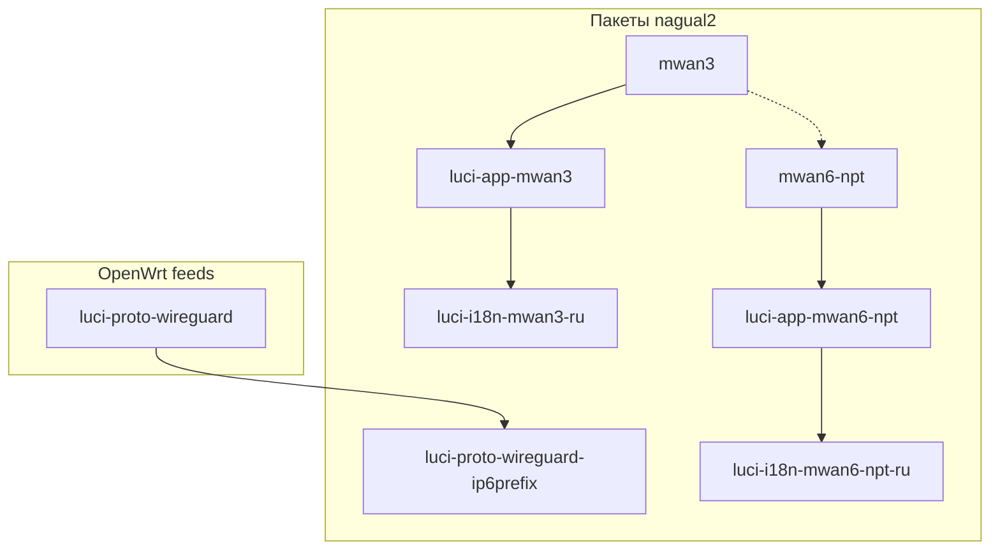

# Установка стека nagual2: IPv6 multi-WAN + NPTv6

**Русский** | [English](INSTALL-stack.en.md) | [Deutsch](INSTALL-stack.de.md)

Единая инструкция по установке и порядку настройки пакетов для **нескольких IPv6 WAN** (WireGuard, 6in4, …) с балансировкой **mwan3**, трансляцией префиксов **NPTv6** (**mwan6-npt**) и веб-интерфейсом **LuCI**.

**Содержание:** [§1.1 минимальный набор](#11-минимальный-вариант-мало-ram--без-лишнего-luci) · [§3 префиксы](#3-префиксы-что-делает-mwan6-npt-а-что--нет) · [§3.6 первая установка](#36-первая-установка-что-делает-пакет-автоматически) · [§3.7 PD позже](#37-пакет-установили-раньше-чем-появился-pd-на-lan) · [§3.8 LAN и туннели](#38-настроить-lan-pd-и-туннели-luci-и-консоль) · [§6 установка](#6-установка-с-github-releases) · [§8 настройка](#8-порядок-настройки-после-установки)

На роутере после установки **mwan6-npt** файл доступен как:

`/usr/share/doc/mwan6-npt/INSTALL-stack.ru.md`

---

## 1. Состав стека

| № | Пакет | Репозиторий | Роль |
|---|--------|-------------|------|
| 1 | **mwan3** | [nagual2/mwan3](https://github.com/nagual2/mwan3) | Policy routing IPv4/IPv6, health check, failover |
| 2 | **luci-app-mwan3** | [nagual2/luci-app-mwan3](https://github.com/nagual2/luci-app-mwan3) | LuCI для mwan3 и fork-опций |
| 3 | **luci-i18n-mwan3-ru** *(опц.)* | [nagual2/luci-i18n-mwan3-ru](https://github.com/nagual2/luci-i18n-mwan3-ru) | Русский UI для LuCI mwan3 |
| 4 | **luci-proto-wireguard-ip6prefix** *(рекоменд.)* | [nagual2/luci-proto-wireguard-ip6prefix](https://github.com/nagual2/luci-proto-wireguard-ip6prefix) | Поле **IPv6 routed prefix** (`ip6prefix`) в LuCI для WireGuard |
| 5 | **mwan6-npt** | [nagual2/mwan6-npt](https://github.com/nagual2/mwan6-npt) | NPTv6 между LAN-префиксом и WAN-префиксами туннелей |
| 6 | **luci-app-mwan6-npt** | [nagual2/mwan6-npt-luci](https://github.com/nagual2/mwan6-npt-luci) | LuCI для mwan6-npt |
| 7 | **luci-i18n-mwan6-npt-ru** *(опц.)* | [nagual2/luci-i18n-mwan6-npt-ru](https://github.com/nagual2/luci-i18n-mwan6-npt-ru) | Русский UI для NPTv6 |

**Зависимости из официальных feeds** (обычно уже на образе с LuCI):

- `kmod-wireguard`, `wireguard-tools`, `luci-proto-wireguard` — если используете WireGuard;
- `nftables`, `ip-full` — для mwan6-npt (подтягиваются с пакетом);
- `luci-base`, `rpcd` — для LuCI-приложений.



### 1.1. Минимальный вариант (мало RAM / без лишнего LuCI)

Если роутер слабый или не нужен полный веб-интерфейс, ставьте **только ядро**:

| Обязательно | Можно не ставить |
|-------------|------------------|
| **mwan3** (nagual2) | luci-i18n-mwan3-ru, luci-i18n-mwan6-npt-ru |
| **mwan6-npt** | luci-app-mwan6-npt (настройка через `uci` / `vi`) |
| **luci-proto-wireguard-ip6prefix** — только если настраиваете WG в LuCI и лень править UCI вручную | luci-app-mwan3 (достаточно `uci` + `mwan3 sync-track-routes`) |

```bash
cd /tmp
apk add --allow-untrusted ./mwan3-*.apk ./mwan6-npt-*.apk
# по желанию, одна маленькая LuCI-надстройка для ip6prefix на WG:
apk add --allow-untrusted ./luci-proto-wireguard-ip6prefix-*.apk
```

Дальше — только **§3** (префиксы) и **§8.3** (mwan6-npt вручную). Полный стек из §1 — для удобства администрирования, не для работы NPT как таковой.

---

## 2. Зачем форк / отдельный пакет (по каждому)

### 2.1. mwan3 — форк [openwrt/packages `net/mwan3`](https://github.com/openwrt/packages/tree/master/net/mwan3)

**Почему отдельный репозиторий:** патчи для IPv6 multi-WAN (несколько WG/туннелей) без поддержки всего feed `packages`.

**Что добавлено (nagual2):**

| Функция | UCI / команда | Зачем |
|---------|----------------|-------|
| **track_host_routes** | `mwan3.globals.track_host_routes=1` | Маршруты `/32`/`/128` до каждого `track_ip` в таблице mwan3 — иначе `mwan3track` не пингует по нужному IPv6-туннелю |
| Hotplug + sync | `mwan3 sync-track-routes` | Восстановление host-маршрутов после `network restart` |
| **connected_ipv6** | `connected_ipv6_min_prefixlen=32` | Не класть в ipset широкие префиксы (`::/1`, `8000::/1`, `2000::/3`) — иначе policy mwan3 обходится |
| Flush conntrack | `mwan3 flush-conntrack` | После смены policy — корректный CONNMARK |

Без этого форка stock **mwan3** из feeds на сценарии «несколько IPv6 WG + разные default» часто даёт ложный down интерфейса или обход правил.

---

### 2.2. luci-app-mwan3 — форк [openwrt/luci `applications/luci-app-mwan3`](https://github.com/openwrt/luci)

**Почему форк:** stock LuCI не знает новых опций nagual2 **mwan3**.

**Что добавлено в GUI:**

| Раздел | Опции / действия |
|--------|------------------|
| **Сеть → MWAN → Globals** | `track_host_routes`, `connected_ipv6_min_prefixlen` |
| **Interfaces** | Per-interface override `track_host_routes` |
| **Status → Diagnostics** | **Sync track host routes**, **Flush conntrack** |

Требует на роутере **mwan3** из [nagual2/mwan3](https://github.com/nagual2/mwan3), не stock.

---

### 2.3. luci-i18n-mwan3-ru — дополнение к feeds `luci-i18n-mwan3-ru`

**Почему отдельный пакет:** официальный `luci-i18n-mwan3-ru` переводит только upstream-строки; строки форка (`Track host routes (nagual2)`, диагностика и т.д.) остаются на английском.

**Что добавлено:** объединённый `.lmo` (upstream `mwan3.po` + `mwan3-nagual2.po`).

Ставить **после** `luci-app-mwan3`. Не удалять `luci-app-mwan3` через `apk del` — из‑за зависимости подтянется stock из feeds.

---

### 2.4. luci-proto-wireguard-ip6prefix — патч-пакет к stock `luci-proto-wireguard`

**Почему отдельный пакет:** в stock LuCI поле **IPv6 routed prefix** (`ip6prefix`) для WireGuard спрятано или отсутствует в **General Settings**; для NPTv6 и RA на LAN префикс на интерфейсе WG должен быть задан явно в UCI (`network.<iface>.ip6prefix`).

**Что добавлено:**

- Поле **IPv6 routed prefix** (`ip6prefix`) на вкладке **General Settings** в редакторе WireGuard;
- Убрана дублирующая/нестандартная привязка `pd_prefix` → стандартный `ip6prefix`;
- Post-install копирует патченный `wireguard.js` в `/www/luci-static/resources/protocol/`.

Зависит от версии **`luci-proto-wireguard`** на роутере (в `.apk` указано в `depends`, например `luci-proto-wireguard~26.x`).

---

### 2.5. mwan6-npt — собственный пакет (не форк)

**Почему отдельный репозиторий:** в OpenWrt нет готового аналога «NPTv6 для нескольких WAN» под **fw4/nftables**.

**Что делает:**

- Читает `/etc/config/mwan6-npt` (UCI);
- Генерирует правила **NPTv6** (srcnat/dstnat prefix) в `nftables` через hooks `fw4`;
- Hotplug при up/down интерфейсов;
- Одна секция `lan` с `default=1` — источник LAN-префикса; остальные WAN — трансляция в/из него.

Не заменяет **mwan3**: mwan3 выбирает **какой** WAN использовать; mwan6-npt выравнивает **префиксы** при разных WAN-префиксах.

---

### 2.6. luci-app-mwan6-npt (репозиторий mwan6-npt-luci) — собственное LuCI-приложение

**Почему отдельный репозиторий:** stock LuCI не содержит UI для mwan6-npt.

**Что добавлено:**

- **Сеть → NPTv6 Multi-WAN** — globals, LAN-префикс, таблица WAN;
- Автоопределение LAN (`detect-lan-prefix.sh`), подсказка WAN (`detect-wan-prefix.sh`);
- **Статус → NPTv6 Multi-WAN** — `status`, update, flush;
- **Сохранить и применить** → `/etc/init.d/mwan6-npt reload`.

Требует установленный **mwan6-npt**.

---

### 2.7. luci-i18n-mwan6-npt-ru — локализация

**Почему отдельный пакет:** как у mwan3 — перевод строк приложения mwan6-npt-luci.

**Что добавлено:** `mwan6-npt.ru.lmo` для меню и форм NPTv6.

Ставить **после** `luci-app-mwan6-npt`.

---

## 3. Префиксы: что делает mwan6-npt, а что — нет

Кратко собрать в одну картину **до** установки и правки `/etc/config/mwan6-npt`.

### 3.1. Два разных места конфигурации

| Где | Что задаётся | Зачем |
|-----|--------------|--------|
| **`/etc/config/network`** (интерфейс **lan**, туннели WG/6in4) | **PD / delegated prefix** для LAN: `ip6assign`, `ip6prefix`, RA/SLAAC клиентам | Адреса **внутри** сети; раздача IPv6 хостам |
| **`/etc/config/mwan6-npt`** | Поле **`wan_prefix`** по секциям (LAN-источник + каждый WAN) | Только **правила NPTv6** в nftables; префиксы на интерфейс **не** вешает |

**mwan6-npt не добавляет префиксы на интерфейсы** — он читает UCI и генерирует **трансляцию** «LAN-префикс ↔ префикс туннеля» при прохождении пакета через fw4.

### 3.2. LAN-префикс может не совпадать ни с одним туннелем — это нормально

- Префикс, который вы раздаёте по **SLAAC на LAN** (PD), **может не совпадать** с префиксами на WAN/WG — так и задумано для NPTv6.
- В туннели уходят пакеты с **преобразованной** «правой частью» (префиксом источника после NPT), а клиенты LAN продолжают использовать **свой** GUA/PD.
- Секция **`lan`** в `mwan6-npt` с `default=1` — это **источник** для NPT (поле `wan_prefix` там = ваш LAN/PD префикс в логике пакета), а не «префикс с интерфейса lan автоматически с роутера».

**Рекомендация:** в продакшене прописывайте **GUA** (глобальные префиксы провайдера), **не ULA** (`fd00::/8`). ULA в README и примерах — **только для лаборатории** без реального IPv6.

### 3.3. Откуда взять PD на LAN (пример)

На интерфейсе **lan** нужен префикс для раздачи по **SLAAC/RA**, желательно стабильный GUA:

- от основного провайдера (PD на WAN);
- или **статический делегированный префикс** с туннельного брокера, например [Hurricane Electric Tunnelbroker](https://tunnelbroker.net) — даже если **сейчас** этот туннель не используется как основной WAN: префикс может жить **только во внутренней сети** (6in4 на `henet`, `ip6prefix` / RA на `lan`), а исходящий трафик в другие WG-туннели пойдёт уже с NPT в их префиксы;
- этот LAN-префикс **не обязан** совпадать ни с одним `wan_prefix` туннеля в `mwan6-npt`.

Пример идеи (цифры замените своими):

```uci
# /etc/config/network — фрагмент
config interface 'lan'
	option ip6assign '64'
	# или явно, если брокер выдал делегацию:
	# list ip6prefix '2001:db8:100::/56'

config interface 'henet'
	option proto '6in4'
	# … учётные данные tunnelbroker …
	list ip6prefix '2001:db8:100::/56'
```

### 3.4. WAN / WireGuard: префикс на интерфейсе

Для каждого туннеля в **`network`** нужно знать **маршрутизируемый IPv6-префикс** туннеля (то, что видит ядро на этом интерфейсе) — обычно `list ip6prefix '…'` у WG.

- Через консоль: `uci set network.wg0.ip6prefix='2001:db8:1::/56'` (имя интерфейса своё).
- Если лень ковырять UCI вручную — пакет **[luci-proto-wireguard-ip6prefix](https://github.com/nagual2/luci-proto-wireguard-ip6prefix)**: в LuCI у интерфейса WireGuard в **General Settings** появится поле **IPv6 routed prefix** (`ip6prefix`).

Эти префиксы **не копируются** в `mwan6-npt` автоматически.

### 3.5. После установки mwan6-npt конфиг «пустой» по WAN — ожидаемо

Пакет при первой установке создаёт только:

- `globals` (`enabled=0`);
- секцию **`lan`** (`default=1`, без готовых `wan_prefix` с туннелей).

**Почему нет PD/WAN-префиксов в `/etc/config/mwan6-npt`:** они должны быть **сначала** заданы (или осмысленно выбраны) в `network` / у вас в схеме; mwan6-npt лишь **дублирует логику** в `wan_prefix` для nftables. Добавьте вручную (LuCI **NPTv6 Multi-WAN** или UCI):

```bash
uci set mwan6-npt.lan.wan_prefix='2001:db8:100::/56'   # ваш LAN/PD (источник NPT)
uci add mwan6-npt interface
uci rename mwan6-npt.@interface[-1]='wg0'
uci set mwan6-npt.wg0.wan_prefix='2001:db8:1::/56'
uci set mwan6-npt.wg0.enabled='1'
uci set mwan6-npt.wg0.default='0'
uci commit mwan6-npt
```

Подсказки префиксов: `/usr/share/mwan6-npt/detect-lan-prefix.sh`, `detect-wan-prefix.sh` (если префикс уже есть на интерфейсе).

### 3.6. Первая установка: что делает пакет автоматически

При `apk add` / первом запуске **`/etc/uci-defaults/99-mwan6-npt`** (см. также post-install в `.apk`):

| Шаг | Действие |
|-----|----------|
| 1 | Кладёт шаблон `/etc/config/mwan6-npt` (если файла ещё не было) |
| 2 | Создаёт `globals.enabled=0`, секцию **`lan`** (`enabled=1`, `default=1`) |
| 3 | **`detect-lan-prefix.sh`** — ищет PD/GUA для LAN (см. ниже) и пишет в `lan.wan_prefix`, **если поле пустое** |
| 4 | **`import-from-mwan3.sh`** — если есть `/etc/config/mwan3`, добавляет **отсутствующие** секции WAN по включённым IPv6-интерфейсам mwan3 (без перезаписи ваших правок) |
| 5 | `uci commit`, `enable` init — **без** `mwan6-npt update` (nft-правила не создаются, пока `globals.enabled=0`) |

**Как определяется LAN-префикс** (`detect-lan-prefix.sh`, только чтение):

1. Первый не-ULA `ip6prefix` в **`/etc/config/network`** (любой interface).
2. Иначе — делегированный префикс на интерфейсе **`lan`** через `ubus` (`network.interface.lan` → `ipv6-prefix-assignment`).

Секция UCI **`mwan6-npt.lan`** — это **источник NPT** (логическое имя), не «любой» LAN-bridge; в OpenWrt обычно PD вешают на интерфейс **`network.lan`**.

### 3.7. Пакет установили раньше, чем появился PD на LAN

Типично: провайдер **не отдаёт PD автоматически**, префикс с [Tunnelbroker](https://tunnelbroker.net) или статика прописывается **позже**.

После настройки `network` выполните:

```bash
/usr/share/mwan6-npt/sync-lan-prefix.sh
# или вручную:
uci set mwan6-npt.lan.wan_prefix='2001:db8:100::/56'
uci commit mwan6-npt
```

Затем включите NPT и примените правила (§8.3).

### 3.8. Настроить LAN (PD) и туннели: LuCI и консоль

#### A. LAN — раздача префикса клиентам (SLAAC/RA)

**LuCI (OpenWrt 23+/25):**

1. **Сеть → Интерфейсы → `lan` → Изменить**
2. Вкладка **Общие настройки** / **IPv6 assignment**:
   - **IPv6 assignment length** (`ip6assign`, часто `64`) — если PD приходит с WAN;
   - или **IPv6 routed prefix** / список префиксов — если задёте статический GUA (HE, ручной PD).
3. Для 6in4 HE: отдельный интерфейс `henet` (proto `6in4`), префикс в **`ip6prefix`**, делегация на `lan` через RA — см. документацию HE.
4. **Сохранить и применить** → перезапуск сети.

**Консоль (примеры, подставьте свой GUA):**

```bash
# Делегация длины с WAN (если PD уже на WAN-интерфейсе)
uci set network.lan.ip6assign='64'

# Или явный префикс на lan / от HE
uci add_list network.lan.ip6prefix='2001:db8:100::/56'

uci commit network
/etc/init.d/network reload
sleep 3
/usr/share/mwan6-npt/sync-lan-prefix.sh
```

Проверка: `ubus call network.interface.lan status | jsonfilter -e '@[\"ipv6-prefix-assignment\"]'`

#### B. Туннели (WAN) — префикс на интерфейсе

**LuCI:**

1. **Сеть → Интерфейсы →** ваш WG/туннель → **Изменить**
2. **General settings** → **IPv6 routed prefix** (`ip6prefix`) — поле появляется после пакета **[luci-proto-wireguard-ip6prefix](https://github.com/nagual2/luci-proto-wireguard-ip6prefix)** (для WireGuard).
3. **Сохранить и применить**

**Консоль:**

```bash
uci set network.wg0.ip6prefix='2001:db8:1::/56'   # имя интерфейса своё
uci commit network
/etc/init.d/network reload
```

#### C. Секции в `mwan6-npt` (NPT, не network)

После префиксов в `network`:

```bash
# LAN-источник NPT (если sync-lan-prefix.sh не запускали)
uci set mwan6-npt.lan.wan_prefix='2001:db8:100::/56'

# WAN-туннель (имя = логическое имя в network / mwan3)
uci set mwan6-npt.wg0='interface'
uci set mwan6-npt.wg0.enabled='1'
uci set mwan6-npt.wg0.default='0'
uci set mwan6-npt.wg0.wan_prefix='2001:db8:1::/56'

uci commit mwan6-npt
```

**Импорт WAN из mwan3** (если mwan3 уже настроен, секций ещё нет в mwan6-npt):

```bash
/usr/share/mwan6-npt/import-from-mwan3.sh
```

Импортируются интерфейсы mwan3 с **`enabled=1`** и **`family=ipv6`**; для каждого подставляется `wan_prefix` из `network.<имя>.ip6prefix` или `detect-wan-prefix.sh`. Существующие секции **не перезаписываются**.

**LuCI:** **Сеть → NPTv6 Multi-WAN** — LAN-префикс, добавление WAN из списка `network`, подсказка префикса.

Рекомендуемый порядок: **LAN PD в network → sync-lan-prefix → mwan3 → import-from-mwan3 / ручные WAN → `globals.enabled=1` → reload**.

### 3.9. Что ещё имеет смысл учесть

| Тема | Рекомендация |
|------|----------------|
| Порядок | Сначала **`network`** (LAN PD + `ip6prefix` на туннелях), потом **mwan3**, потом **mwan6-npt** |
| mwan3 без LuCI | На минимальном наборе достаточно `uci` + `mwan3 sync-track-routes` после смены policy |
| Один туннель = LAN без NPT | Если туннель уже раздаёт тот же префикс на LAN — секцию этого WAN в mwan6-npt можно **`enabled=0`** |
| RA/odhcpd | После смены LAN-префикса перезапустите сеть/`odhcpd`, проверьте RA на LAN |
| Память | Не ставьте оба LuCI-app + оба i18n на роутерах с RAM меньше 128 MB без необходимости |
| Проверка | `ip -6 addr`, `ip -6 route`, `mwan6-npt status`, `nft list chain inet fw4 srcnat \| grep prefix` |

---

## 4. Требования

| Параметр | Минимум |
|----------|---------|
| OpenWrt | **22.03+** (fw4 / nftables) |
| Менеджер пакетов | **apk** (25.12+) рекомендуется; **opkg** (23.x) поддерживается |
| LuCI | `luci-base` для GUI-пакетов |
| Сценарий | Несколько WAN с IPv6 (WG, SIT, …), нужны failover mwan3 + NPTv6 на LAN |

---

## 5. Порядок установки (важно)

Рекомендуемый порядок:

1. База WireGuard из feeds (если нужен WG).
2. **luci-proto-wireguard-ip6prefix** — до настройки интерфейсов в LuCI.
3. **mwan3**
4. **luci-app-mwan3** (+ **luci-i18n-mwan3-ru**)
5. **mwan6-npt**
6. **luci-app-mwan6-npt** (+ **luci-i18n-mwan6-npt-ru**)

После установки — **pin** в `/etc/apk/world` (см. §7), затем настройка UCI (§8, сначала префиксы §3).

---

## 6. Установка с GitHub Releases

Скачайте `.apk` (OpenWrt **25.12+**) или `.ipk` (**23.x**) с Releases каждого репозитория. Примеры тегов на момент документации:

| Пакет | Пример тега |
|-------|-------------|
| mwan3 | `v2.12.1-r5` |
| luci-app-mwan3 | `v1.0.1` |
| luci-i18n-mwan3-ru | `v1.0.0` |
| mwan6-npt | `v1.1.3` |
| luci-app-mwan6-npt | `v1.2.2` |
| luci-i18n-mwan6-npt-ru | `v1.0.2` |
| luci-proto-wireguard-ip6prefix | `v1.0.0` (r1 или r2 — см. ниже) |

**Прямые ссылки на `.apk` (GitHub Releases):**

| Пакет | Скачать |
|-------|---------|
| mwan3 x86_64 (dev/VM) | [mwan3-2.12.1-r5_x86_64.apk](https://github.com/nagual2/mwan3/releases/download/v2.12.1-r5/mwan3-2.12.1-r5_x86_64.apk) |
| mwan3 aarch64 (mediatek prod) | [mwan3-2.12.1-r5_aarch64_cortex-a53.apk](https://github.com/nagual2/mwan3/releases/download/v2.12.1-r5/mwan3-2.12.1-r5_aarch64_cortex-a53.apk) |
| luci-app-mwan3 | [luci-app-mwan3-1.0.1-r1.apk](https://github.com/nagual2/luci-app-mwan3/releases/download/v1.0.1/luci-app-mwan3-1.0.1-r1.apk) |
| luci-i18n-mwan3-ru | [luci-i18n-mwan3-ru-1.0.0-r1.apk](https://github.com/nagual2/luci-i18n-mwan3-ru/releases/download/v1.0.0/luci-i18n-mwan3-ru-1.0.0-r1.apk) |
| mwan6-npt | [mwan6-npt-1.1.3-r1.apk](https://github.com/nagual2/mwan6-npt/releases/download/v1.1.3/mwan6-npt-1.1.3-r1.apk) |
| luci-app-mwan6-npt | [luci-app-mwan6-npt-1.2.2-r1.apk](https://github.com/nagual2/mwan6-npt-luci/releases/download/v1.2.2/luci-app-mwan6-npt-1.2.2-r1.apk) |
| luci-i18n-mwan6-npt-ru | [luci-i18n-mwan6-npt-ru-1.0.2-r1.apk](https://github.com/nagual2/luci-i18n-mwan6-npt-ru/releases/download/v1.0.2/luci-i18n-mwan6-npt-ru-1.0.2-r1.apk) |
| luci-proto-wireguard-ip6prefix r1 (LuCI ~26.143, dev) | […-r1.apk](https://github.com/nagual2/luci-proto-wireguard-ip6prefix/releases/download/v1.0.0/luci-proto-wireguard-ip6prefix-1.0.0-r1.apk) |
| luci-proto-wireguard-ip6prefix r2 (LuCI ~26.138, prod) | […-r2.apk](https://github.com/nagual2/luci-proto-wireguard-ip6prefix/releases/download/v1.0.0/luci-proto-wireguard-ip6prefix-1.0.0-r2.apk) |

**mwan3:** имя файла зависит от архитектуры (`apk info arch` → третья строка). **ip6prefix:** зависит от версии `luci-proto-wireguard` (`apk policy luci-proto-wireguard`).

### 6.1. OpenWrt 25.12+ (`apk`)

На роутере (или с ПК через `scp` + `ssh`):

```bash
cd /tmp

# 1) WireGuard LuCI patch (после luci-proto-wireguard из feeds)
# apk add luci-proto-wireguard   # если ещё нет
# r1 — LuCI ~26.143 (dev); r2 — LuCI ~26.138 (prod mediatek)
apk add --allow-untrusted ./luci-proto-wireguard-ip6prefix-1.0.0-r2.apk

# 2) mwan3 (x86_64 или aarch64_cortex-a53 — см. таблицу выше)
apk add --allow-untrusted ./mwan3-2.12.1-r5_aarch64_cortex-a53.apk

# 3) LuCI mwan3
apk add --allow-untrusted ./luci-app-mwan3-*-r*.apk
apk add --allow-untrusted ./luci-i18n-mwan3-ru-*-r*.apk   # опционально

# 4) NPTv6
apk add --allow-untrusted ./mwan6-npt-*-r*.apk
apk add --allow-untrusted ./luci-app-mwan6-npt-*-r*.apk
apk add --allow-untrusted ./luci-i18n-mwan6-npt-ru-*-r*.apk   # опционально

# Службы LuCI
/etc/init.d/rpcd restart
/etc/init.d/uhttpd restart
```

**С ПК (PowerShell), пример:**

```powershell
$ROUTER = "192.168.1.1"
$DIST = "C:\path\to\downloaded\apks"
scp "$DIST\*.apk" "root@${ROUTER}:/tmp/"
ssh root@$ROUTER "cd /tmp && apk add --allow-untrusted ./mwan3-*.apk ./luci-app-mwan3-*.apk ./mwan6-npt-*.apk ./luci-app-mwan6-npt-*.apk"
```

Готовые скрипты установки в репозиториях:

| Пакет | Скрипт |
|-------|--------|
| mwan3 | `./scripts/install-apk.sh <router-ip>` |
| luci-app-mwan3 | `./scripts/install-apk.sh <router-ip>` |
| mwan6-npt | `./scripts/install-apk.sh <router-ip>` |
| mwan6-npt-luci | `./scripts/install-apk.sh <router-ip>` |
| luci-proto-wireguard-ip6prefix | `./scripts/install-apk.sh <router-ip>` |
| luci-i18n-mwan3-ru | `./scripts/install-apk.sh <router-ip>` |
| luci-i18n-mwan6-npt-ru | `./scripts/install-apk.sh <router-ip>` |

На prod после flash можно использовать готовый скрипт: `Backup/openwrt-prod/scripts/install_prod_packages.sh` (feeds + nagual2 с GitHub).

### 6.2. OpenWrt 23.x (`opkg` / `.ipk`)

```bash
cd /tmp
opkg install ./mwan3_*.ipk
opkg install ./luci-app-mwan3_*.ipk
opkg install ./luci-i18n-mwan3-ru_*.ipk      # опционально
opkg install ./mwan6-npt_*.ipk
opkg install ./luci-app-mwan6-npt_*.ipk
opkg install ./luci-i18n-mwan6-npt-ru_*.ipk  # опционально
opkg install ./luci-proto-wireguard-ip6prefix_*.ipk

/etc/init.d/mwan3 enable
/etc/init.d/mwan3 start
/etc/init.d/rpcd restart
/etc/init.d/uhttpd restart
```

На **apk** pin для opkg-пакетов не используется; обновления feeds могут перезаписать stock — на 23.x следите за версиями вручную.

---

## 7. Закрепление fork (pin, только `apk`)

При `apk add --allow-untrusted ./package.apk` в `/etc/apk/world` появляется строка с хешем сборки:

```text
mwan3><Q1……………=
luci-app-mwan3><Q1……………=
mwan6-npt><Q1……………=
luci-app-mwan6-npt><Q1……………=
```

Без `><` пакет берётся из **официальных feeds** (stock), что **ломает** IPv6 multi-WAN.

**Проверка:**

```bash
grep -E '^(mwan3|mwan6-npt|luci-app-mwan3|luci-app-mwan6-npt|luci-proto-wireguard-ip6prefix)><' /etc/apk/world
apk policy mwan3
apk policy mwan6-npt
```

Подробнее: [luci-app-mwan3 — Pinning](https://github.com/nagual2/luci-app-mwan3/blob/main/README.ru.md#закрепление-fork-pin-apk).

**Обновление fork:** снова `apk add --allow-untrusted ./NEW.apk` — pin обновится.

**Не делайте** `apk del luci-app-mwan3` при установленном `luci-i18n-mwan3-ru` — apk может поставить stock LuCI.

---

## 8. Порядок настройки после установки

Сначала прочитайте **§3** (префиксы). Краткая цепочка: **network (LAN PD + ip6prefix на туннелях) → mwan3 → mwan6-npt**.

### 8.1. Сеть, LAN PD и WireGuard

1. **lan** — задайте PD/GUA для SLAAC (`ip6assign` / `ip6prefix` / делегация с HE или провайдера); см. §3.3.
2. **Туннели** — у каждого WAN/WG пропишите **`ip6prefix`** в `network` (консоль или [luci-proto-wireguard-ip6prefix](https://github.com/nagual2/luci-proto-wireguard-ip6prefix)); см. §3.4.
3. `network reload` / перезапуск интерфейсов; проверьте `ip -6 addr show dev lan` и туннели.
4. Зоны **firewall** LAN/WAN — как в вашей схеме.

### 8.2. mwan3

1. LuCI: **Сеть → Load Balancing (MWAN)** или `/etc/config/mwan3`.
2. Включите интерфейсы, `track_ip`, политики, members.
3. В **Globals** проверьте:
   - `track_host_routes` — **1** (для IPv6 WG);
   - `connected_ipv6_min_prefixlen` — **32**.
4. Примените:

```bash
/etc/init.d/mwan3 restart
mwan3 sync-track-routes
```

### 8.3. mwan6-npt

После установки в конфиге **нет** готовых `wan_prefix` для туннелей — только секция `lan`; см. §3.5.

1. LuCI: **Сеть → NPTv6 Multi-WAN** или `vi /etc/config/mwan6-npt`.
2. **`lan.wan_prefix`** — тот же префикс, что раздаёте на LAN (PD), может **не совпадать** ни с одним туннелем.
3. Для каждого WAN добавьте секцию (имя = логическое имя в `network`), **`wan_prefix`** = префикс этого туннеля из `network` (не подставляется сам).
4. Туннель, который уже несёт тот же префикс на LAN без NPT — `option enabled '0'`.
5. Включите и примените:

```bash
uci set mwan6-npt.globals.enabled='1'
uci commit mwan6-npt
/etc/init.d/mwan6-npt reload
/etc/init.d/mwan6-npt enable
```

**Проверка:**

```bash
/usr/sbin/mwan6-npt status
nft list chain inet fw4 srcnat | grep -i prefix
```

### 8.4. Русский интерфейс

**Система → Язык → Русский (Russian)** → Сохранить → обновить страницу браузера.

---

## 9. Локальный apk-feed (несколько роутеров)

См. [luci-app-mwan3 — локальный feed](https://github.com/nagual2/luci-app-mwan3/blob/main/README.ru.md#локальный-apk-feed-несколько-роутеров): публикация всех `.apk` в `/www/nagual2/`. Установка по-прежнему с **`--allow-untrusted`**; после установки проверьте pin (§7).

---

## 10. Устранение неполадок

| Симптом | Проверка |
|---------|----------|
| После установки в mwan6-npt «нет префиксов» | Норма, если PD ещё не в **network**: §3.7–3.8, `sync-lan-prefix.sh` |
| Импорт из mwan3 пустой | В mwan3 нет `enabled=1` + `family=ipv6`; задайте WAN вручную или включите интерфейсы в mwan3 |
| Клиенты LAN без глобального IPv6 | PD/RA на **lan** в `network`, GUA а не только ULA (§3.2–3.3) |
| NPT есть, адреса LAN «не те» | `lan.wan_prefix` должен совпадать с префиксом раздачи на LAN, не с туннелем |
| mwan3track не видит IPv6 peer | `track_host_routes=1`, `mwan3 sync-track-routes`, `ip -6 route show table …` |
| Трафик в обход policy | `connected_ipv6_min_prefixlen`, `mwan3 flush-conntrack` после смены policy |
| Нет поля IPv6 prefix у WG | установлен **luci-proto-wireguard-ip6prefix**, перезапуск `uhttpd` |
| NPT не работает | `globals.enabled=1`, `mwan6-npt reload`, `nft` rules, совпадение имён интерфейсов UCI/network |
| После `apk upgrade` снова stock | `grep '><' /etc/apk/world`, переустановить nagual2 `.apk` |
| Английские строки в LuCI | установить **luci-i18n-*-ru** после app-пакета |

---

## 11. Документация по пакетам

| Тема | Путь на роутере / ссылка |
|------|---------------------------|
| Этот документ | `/usr/share/doc/mwan6-npt/INSTALL-stack.ru.md` |
| mwan6-npt | `/usr/share/doc/mwan6-npt/README.ru.md` |
| mwan3 | `/usr/share/doc/mwan3/README.ru.md` |
| luci-app-mwan3 | `/usr/share/doc/luci-app-mwan3/README.ru.md` |
| luci-app-mwan6-npt | `/usr/share/doc/luci-app-mwan6-npt/README.ru.md` |
| luci-proto-wireguard-ip6prefix | [GitHub README.ru.md](https://github.com/nagual2/luci-proto-wireguard-ip6prefix/blob/master/README.ru.md) |

---

## 12. Лицензии

| Пакет | Лицензия |
|-------|----------|
| mwan3, luci-app-mwan3 | GPL-2.0 (как upstream) |
| mwan6-npt, luci-app-mwan6-npt, i18n, wireguard-ip6prefix | Apache-2.0 (как LuCI) / см. `NOTICE` в каждом репозитории |

---

*Документ входит в пакет **mwan6-npt** (nagual2). Версия инструкции: 2026-06-06.*
